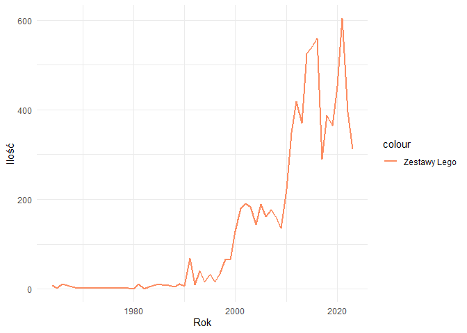
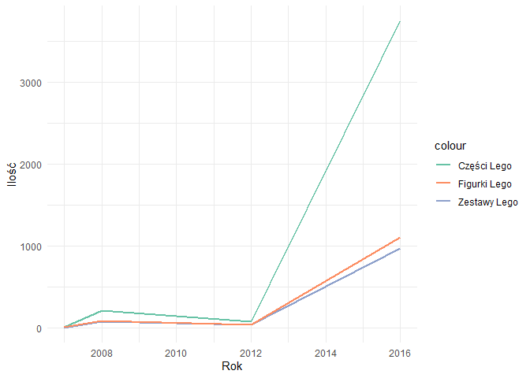

# Executive summary

# Powtarzalność Wyników

Dla zapewnienia powtarzalności wyników przy każdym uruchomieniu raportu dla tych samych danych, ustawiono ziarno dla generatora liczb pseudolosowych.


```r
set.seed(23)
```

# Wykorzystane biblioteki
Raport został stworzony przy wykorzystaniu następujących bibliotek.


```r
library(dplyr)
library(ggplot2)
```

# Kod odpowiedzialny za wczytanie danych z plików


```r
colors <- read.csv("dataset/colors.csv")
parts_cat <- read.csv("dataset/part_categories.csv")
elements <- read.csv("dataset/elements.csv")
parts <- read.csv("dataset/parts.csv")
inv_parts <- read.csv("dataset/inventory_parts.csv")

figs <- read.csv("dataset/minifigs.csv")
inv_figs <- read.csv("dataset/inventory_minifigs.csv")

themes <- read.csv("dataset/themes.csv")
sets <- read.csv("dataset/sets.csv")
inv_sets <- read.csv("dataset/inventory_sets.csv")

inventories <- read.csv("dataset/inventories.csv")
```

# Oczyszczenie i przetwarzanie danych
Ta sekcja poświęcona jest przetworzeniu brakujących wartości oraz transformacji wykorzystanych zbiorów danych.

## Zestawy Lego


```r
themes <- setNames(themes, c("theme_id", "theme_name", "parent_id"))
colnames(sets)[colnames(sets) == "name"] <- "set_name"
colnames(sets)[colnames(sets) == "num_parts"] <- "set_num_parts"
colnames(inv_sets)[colnames(inv_sets) == "quantity"] <- "set_qty"

inventory_sets <- inv_sets %>%
  merge(sets, by = "set_num") %>%
  merge(themes, by = "theme_id") %>%
  select(-c("theme_id","img_url","parent_id"))
```

### Podsumowanie zbioru


```r
knitr::kable(summary(inventory_sets), caption = "Podstawowe statystyki - zestawy Lego")
```


Table: Podstawowe statystyki - zestawy Lego

|   |  set_num        | inventory_id  |   set_qty     |  set_name       |     year    |set_num_parts  | theme_name      |
|:--|:----------------|:--------------|:--------------|:----------------|:------------|:--------------|:----------------|
|   |Length:4358      |Min.   :    35 |Min.   : 1.000 |Length:4358      |Min.   :1964 |Min.   :   0.0 |Length:4358      |
|   |Class :character |1st Qu.:  8076 |1st Qu.: 1.000 |Class :character |1st Qu.:2004 |1st Qu.:   9.0 |Class :character |
|   |Mode  :character |Median : 16423 |Median : 1.000 |Mode  :character |Median :2011 |Median :  45.0 |Mode  :character |
|   |NA               |Mean   : 52519 |Mean   : 1.813 |NA               |Mean   :2010 |Mean   : 119.3 |NA               |
|   |NA               |3rd Qu.: 98685 |3rd Qu.: 1.000 |NA               |3rd Qu.:2016 |3rd Qu.: 121.0 |NA               |
|   |NA               |Max.   :191576 |Max.   :60.000 |NA               |Max.   :2023 |Max.   :4024.0 |NA               |

```r
summarized_data <- inventory_sets %>%
   group_by(year) %>%
   summarise(
       total_set_qty = sum(set_qty, na.rm = TRUE)
   )

ggplot(summarized_data , aes(x = year, y = total_set_qty)) +
 geom_line(aes(y = total_set_qty, color = "Zestawy Lego"), size = 1) +
 labs(x = "Rok", y = "Ilość") +
 scale_color_manual(
   values=c("#fc8d62")) +
 theme_minimal()
```

<!-- -->

## Figurki Lego


```r
colnames(figs)[colnames(figs) == "name"] <- "fig_name"
colnames(figs)[colnames(figs) == "num_parts"] <- "fig_num_parts"
colnames(inv_figs)[colnames(inv_figs) == "quantity"] <- "fig_qty"

inventory_minifigures <- inv_figs %>%
  merge(figs, by = "fig_num") %>%
  select(-img_url)
```

### Podsumowanie zbioru


```r
knitr::kable(summary(inventory_minifigures), caption = "Podstawowe statystyki - figurki Lego")
```


Table: Podstawowe statystyki - figurki Lego

|   |  fig_num        | inventory_id  |   fig_qty      |  fig_name       |fig_num_parts   |
|:--|:----------------|:--------------|:---------------|:----------------|:---------------|
|   |Length:20858     |Min.   :     3 |Min.   :  1.000 |Length:20858     |Min.   :  0.000 |
|   |Class :character |1st Qu.:  7869 |1st Qu.:  1.000 |Class :character |1st Qu.:  4.000 |
|   |Mode  :character |Median : 15681 |Median :  1.000 |Mode  :character |Median :  4.000 |
|   |NA               |Mean   : 43010 |Mean   :  1.062 |NA               |Mean   :  4.813 |
|   |NA               |3rd Qu.: 66834 |3rd Qu.:  1.000 |NA               |3rd Qu.:  5.000 |
|   |NA               |Max.   :194312 |Max.   :100.000 |NA               |Max.   :143.000 |

## Części Lego


```r
colnames(parts)[colnames(parts) == "name"] <- "part_name"
colnames(parts_cat)[colnames(parts_cat) == "name"] <- "part_cat_name"
colnames(parts_cat)[colnames(parts_cat) == "id"] <- "part_cat_id"
colnames(colors)[colnames(colors) == "name"] <- "color_name"
colnames(colors)[colnames(colors) == "id"] <- "color_id"
colnames(inv_parts)[colnames(inv_parts) == "quantity"] <- "part_qty"

element_counts <- elements %>%
  group_by(part_num, color_id) %>%
  summarise(element_count = n())

inventory_parts <- inv_parts %>%
  merge(parts, by = "part_num") %>%
  merge(colors, by = "color_id") %>%
  merge(parts_cat, by = "part_cat_id") %>%
  merge(element_counts, by = c("part_num", "color_id")) %>%
  select(-c(part_num, color_id, img_url, part_cat_id, rgb, is_spare))
```

### Podsumowanie zbioru


```r
knitr::kable(summary(inventory_parts), caption = "Podstawowe statystyki - części Lego")
```


Table: Podstawowe statystyki - części Lego

|   | inventory_id  |   part_qty      | part_name       |part_material    | color_name      |  is_trans       |part_cat_name    |element_count |
|:--|:--------------|:----------------|:----------------|:----------------|:----------------|:----------------|:----------------|:-------------|
|   |Min.   :     3 |Min.   :   1.000 |Length:1100246   |Length:1100246   |Length:1100246   |Length:1100246   |Length:1100246   |Min.   :1.000 |
|   |1st Qu.:  9605 |1st Qu.:   1.000 |Class :character |Class :character |Class :character |Class :character |Class :character |1st Qu.:1.000 |
|   |Median : 23669 |Median :   2.000 |Mode  :character |Mode  :character |Mode  :character |Mode  :character |Mode  :character |Median :1.000 |
|   |Mean   : 51841 |Mean   :   3.432 |NA               |NA               |NA               |NA               |NA               |Mean   :1.591 |
|   |3rd Qu.: 90217 |3rd Qu.:   4.000 |NA               |NA               |NA               |NA               |NA               |3rd Qu.:2.000 |
|   |Max.   :194312 |Max.   :3064.000 |NA               |NA               |NA               |NA               |NA               |Max.   :9.000 |

## Połączenie danych


```r
inventory_all <- inventory_sets %>%
  merge(inventory_minifigures, by = "inventory_id") %>%
  merge(inventory_parts, by = "inventory_id")

 summarized_data <- inventory_all %>%
     group_by(year) %>%
     summarise(
         total_set_qty = sum(set_qty, na.rm = TRUE),
         total_part_qty = sum(part_qty, na.rm = TRUE),
         total_fig_qty = sum(fig_qty, na.rm = TRUE)
     )
 ggplot(summarized_data , aes(x = year)) +
     geom_line(aes(y = total_set_qty, color = "Zestawy Lego"), size = 1) +
     geom_line(aes(y = total_part_qty, color = "Części Lego"), size = 1) +
     geom_line(aes(y = total_fig_qty, color = "Figurki Lego"), size = 1) +
     labs(x = "Rok", y = "Ilość") +
     scale_color_manual(
         values=
             c("#66c2a5",
               "#fc8d62",
               "#8da0cb")) +
     theme_minimal()
```

<!-- -->
