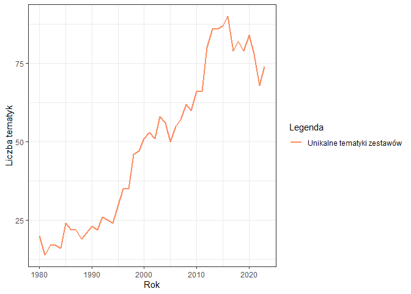
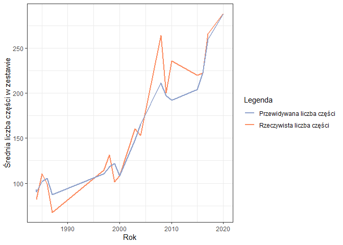

<style type="text/css">
.list-group-item.active, .list-group-item.active:focus, .list-group-item.active:hover {
  background-color: #8da0cb;
  border-color: #8da0cb;
}
</style>

# Executive summary
Raport ma na celu przeanalizowanie oraz interpretacje bazy danych Lego na przestrzeni lat.

Z roku na rok na rynku możemy zauważyć coraz bardziej rozmaite zestawy klocków Lego. Dlatego też analizie poddano elementy związane z zestawami, figurkami oraz poszczególnymi częściami. W raporcie skupiono się na trendach rozwojowych w tej kategorii produktów, badając zmiany w ilości dostępnych tematyk, rozbudowie zestawów, a także w użyciu figurek i różnorodności części.

Analiza danych obejmuje lata 1980-2023 i uwydatnia ewolucję Lego, zarówno pod kątem liczby produktów, jak i ich złożoności. Zbiór danych został uproszczony do obiektów reprezentujących zestawy z klockami (posiadającymi jakieś części).

Zbiór danych został poddany analizie korelacji, dzięki czemu wyróżniono istotne związki pomiędzy różnymi atrybutami, takimi jak rok produkcji, liczba używanych figurek, czy złożoność zestawów. Korelacje te dostarczają głębszego zrozumienia dynamiki rozwoju produktów Lego na przestrzeni lat.

Ostatnim elementem analizy jest sekcja próbująca przewidzieć złożoność zestawów Lego, w tym celu użyto algorytmu uczenia maszynowego Random Forest. Na tej podstawie można wyciągnać wniosek, że największy wpływ na to mają upływający czas oraz ilość figurek.

# Powtarzalność wyników

Dla zapewnienia powtarzalności wyników przy każdym uruchomieniu raportu dla tych samych danych, ustawiono ziarno dla generatora liczb pseudolosowych.


```r
set.seed(23)
```

# Wykorzystane biblioteki
Raport został stworzony przy wykorzystaniu następujących bibliotek.


```r
library(dplyr)
library(ggplot2)
library(tidyr)
library(tibble)
library(plotly)
library(gganimate)
library(caret)
library(randomForest)
```

# Kod odpowiedzialny za wczytanie danych z plików


```r
colors <- read.csv("dataset/colors.csv")
parts_cat <- read.csv("dataset/part_categories.csv")
elements <- read.csv("dataset/elements.csv")
parts <- read.csv("dataset/parts.csv")
inv_parts <- read.csv("dataset/inventory_parts.csv")

figs <- read.csv("dataset/minifigs.csv")
inv_figs <- read.csv("dataset/inventory_minifigs.csv")

themes <- read.csv("dataset/themes.csv")
sets <- read.csv("dataset/sets.csv")
inv_sets <- read.csv("dataset/inventory_sets.csv")

inventories <- read.csv("dataset/inventories.csv")
```

# Oczyszczenie i przetwarzanie danych
Ta sekcja poświęcona jest przetworzeniu brakujących wartości oraz transformacji wykorzystanych zbiorów danych.

## Zestawy Lego
Pierwsza i bardzo ważna część badanego zbioru danych. Zawierają się w niej informacje o zestawach Lego, takie jak: rok wydania, ilość części w zestawie oraz lata w jakich dany zestaw zadebiutował na rynku. 


```r
sets <- sets %>% filter(num_parts > 0)
themes <- setNames(themes, c("theme_id", "theme_name", "parent_id"))
colnames(sets)[colnames(sets) == "name"] <- "set_name"
colnames(sets)[colnames(sets) == "num_parts"] <- "set_num_parts"
colnames(inv_sets)[colnames(inv_sets) == "quantity"] <- "set_qty"

sets_with_themes <- themes %>%
  merge(sets, by = "theme_id") %>%
  select(-c("theme_id","img_url","parent_id"))
```

### Analiza atrybutów
Na wykresach można zaobserwować pewien trend. Wskazuje on na to, że wraz z upływem czasu powstaje coraz więcej zestawów Lego. Dodatkowo są one coraz większe i bardziej rozbudowane, na co wskazuje rosnąca liczba części.


```r
unique_theme_data <- sets_with_themes %>%
    group_by(year) %>%
    filter(year >= 1980) %>%
    filter(year <= 2023) %>%
    summarise(unique_theme = n_distinct(theme_name, na.rm = TRUE))

ggplot(unique_theme_data , aes(x = year, y = unique_theme)) +
    geom_line(aes(y = unique_theme, color = "Unikalne tematyki zestawów"), size = 1) +
    labs(x = "Rok", y = "Liczba tematyk", colour = "Legenda") +
    scale_color_manual(values=c("#fc8d62")) +
    theme_bw()
```

<!-- -->

```r
mean_nparts_data <- sets_with_themes %>%
    group_by(year) %>%
    filter(year >= 1980) %>%
    filter(year <= 2023) %>%
    summarise(sets_mean_nparts = mean(set_num_parts, na.rm = TRUE), sets_count = n())

ggplot(mean_nparts_data , aes(x = year, y = sets_mean_nparts)) +
    ggtitle("Średnia liczba części w zestawach w latach 1980-2023") +
    geom_bar(stat="identity", fill = "#fc8d62") +
    labs(x = "Rok", y = "Liczba części") +
    theme_bw()
```

<!-- -->

### Podsumowanie zbioru


```r
knitr::kable(summary(sets_with_themes), caption = "Podstawowe statystyki - zestawy Lego")
```


Table: Podstawowe statystyki - zestawy Lego

|   | theme_name      |  set_num        |  set_name       |     year    |set_num_parts   |
|:--|:----------------|:----------------|:----------------|:------------|:---------------|
|   |Length:17231     |Length:17231     |Length:17231     |Min.   :1949 |Min.   :    1.0 |
|   |Class :character |Class :character |Class :character |1st Qu.:1999 |1st Qu.:   18.0 |
|   |Mode  :character |Mode  :character |Mode  :character |Median :2011 |Median :   54.0 |
|   |                 |                 |                 |Mean   :2006 |Mean   :  204.9 |
|   |                 |                 |                 |3rd Qu.:2017 |3rd Qu.:  203.0 |
|   |                 |                 |                 |Max.   :2023 |Max.   :11695.0 |

## Figurki Lego
Kolejna część badanego zbioru danych. Możemy znaleźć w niej informacje o figurkach m.in. z czego się składają.  


```r
colnames(figs)[colnames(figs) == "name"] <- "fig_name"
colnames(figs)[colnames(figs) == "num_parts"] <- "fig_num_parts"
colnames(inv_figs)[colnames(inv_figs) == "quantity"] <- "fig_qty"
colnames(inventories)[colnames(inventories) == "id"] <- "inventory_id"

inventory_minifigures <- inv_figs %>%
     merge(figs, by = "fig_num") %>%
     merge(inventories, by = "inventory_id") %>%
     merge(sets, by = "set_num") %>%
     select(-c(1:2, 7:9, 11:13))
```

### Analiza atrybutów
Jeśli chodzi o ilość wykorzystywanych w zestawach figurek to możemy zauważyć, że z czasem pojawiają się coraz częściej.


```r
figures_number <- inventory_minifigures  %>%
    group_by(year) %>%
    filter(year >= 1980) %>%
    filter(year <= 2023) %>%
    summarise(fig_count = n())

ggplot(figures_number , aes(x = year, y = fig_count)) +
     geom_line(aes(y = fig_count, color = "Liczba figurek"), size = 1) +
     labs(x = "Rok", y = "Liczba figurek", colour = "Legenda") +
     scale_color_manual(values=c("#fc8d62")) +
     theme_bw()
```

<!-- -->

### Podsumowanie zbioru


```r
knitr::kable(summary(inventory_minifigures), caption = "Podstawowe statystyki - figurki Lego")
```


Table: Podstawowe statystyki - figurki Lego

|   |  fig_num        |   fig_qty      |  fig_name       |fig_num_parts   |     year    |
|:--|:----------------|:---------------|:----------------|:---------------|:------------|
|   |Length:20817     |Min.   :  1.000 |Length:20817     |Min.   :  1.000 |Min.   :1975 |
|   |Class :character |1st Qu.:  1.000 |Class :character |1st Qu.:  4.000 |1st Qu.:2006 |
|   |Mode  :character |Median :  1.000 |Mode  :character |Median :  4.000 |Median :2014 |
|   |                 |Mean   :  1.062 |                 |Mean   :  4.814 |Mean   :2011 |
|   |                 |3rd Qu.:  1.000 |                 |3rd Qu.:  5.000 |3rd Qu.:2019 |
|   |                 |Max.   :100.000 |                 |Max.   :143.000 |Max.   :2023 |

## Części Lego
Ostatania część badanego zestawu danych zawiera informacje na temat części Lego. Znajdują się w niej szczegóły poszczególnych części: elementy z których się składają, kolor, materiał z którego zostały wykonane oraz kategoria do której przynależą.


```r
colnames(parts)[colnames(parts) == "name"] <- "part_name"
colnames(parts_cat)[colnames(parts_cat) == "name"] <- "part_cat_name"
colnames(parts_cat)[colnames(parts_cat) == "id"] <- "part_cat_id"
colnames(colors)[colnames(colors) == "name"] <- "color_name"
colnames(colors)[colnames(colors) == "id"] <- "color_id"
colnames(inv_parts)[colnames(inv_parts) == "quantity"] <- "part_qty"

element_counts <- elements %>%
  group_by(part_num, color_id) %>%
  summarise(el_per_part = n())

inventory_parts <- inv_parts %>%
  merge(parts, by = "part_num") %>%
  merge(colors, by = "color_id") %>%
  merge(parts_cat, by = "part_cat_id") %>%
  merge(element_counts, by = c("part_num", "color_id")) %>%
  merge(inventories, by = "inventory_id") %>%
  merge(sets, by = "set_num") %>%
  select(-c(1:2, 4, 7:8, 12, 16:17, 19:21))
```

### Analiza atrybutów
W przypadku części Lego również można dostrzec pewne trendy. Wykorzystywane elementy są coraz bardziej zróżnicowane, poprzez tworzenie części z nowych materiałów oraz w nowych kolorach. Warte wyróżnienia jest, że złożoność części się nie zmieniła (na jedną część średnio przypada 1.6 elementu)


```r
transparent_parts <- inventory_parts %>%
    group_by(is_trans) %>%
    filter(year >= 1980) %>%
    filter(year <= 2023) %>%
    summarise(trans_part_count = n())

ggplot(transparent_parts, aes(x=is_trans, y=trans_part_count, fill=is_trans)) + 
  geom_bar(stat="identity", position="dodge") +
  scale_fill_manual(values = c("t" = "#66c2a5", "f" = "#fc8d62"), labels = c("TAK", "NIE")) +
  scale_x_discrete(labels = c("t" = "TAK", "f" = "NIE")) +
  labs(title = "Zestawienie kolorów (transparentność)", x = "Transparentność", y = "Liczba obserwacji", fill = "Legenda") +
  theme_bw()
```

<!-- -->

```r
unique_data <- inventory_parts %>%
    filter(year >= 1980) %>%
    filter(year <= 2023) %>%
    group_by(year, part_material) %>%
    summarise(count = n(), type = "Material") %>%
    bind_rows(
        inventory_parts %>%
            group_by(year, color_name) %>%
            summarise(count = n(), type = "Color") %>%
            bind_rows(
                inventory_parts %>%
                    group_by(year, part_cat_name) %>%
                    summarise(count = n(), type = "Category")
            )
    )

ggplot(unique_data, aes(x = year, y = count, fill = type)) +
  geom_bar(stat = "identity", position = "dodge") +
  facet_grid(type ~ ., scales = "free_y", labeller = labeller(type = c("Material" = "Materiały", "Color" = "Kolory", "Category" = "Kategorie"))) +
  scale_fill_manual(values = c("Category" = "#66c2a5", "Color" = "#fc8d62", "Material" = "#8da0cb"), labels = c("Kategorie", "Kolory", "Materiały")) +
  labs(x = "Rok", y = "Liczba obserwacji", fill = "Legenda") +
  theme_bw()
```

<!-- -->

```r
elements_count <- inventory_parts %>%
  group_by(year) %>%
  filter(year >= 1980) %>%
  filter(year <= 2023) %>%
  summarise(el_in_part = mean(el_per_part, na.rm = TRUE))

ggplot(elements_count  , aes(x = year, y = el_in_part)) +
  geom_line(aes(color = "Średnia ilość elementów w częściach"), size = 1) +
  labs(x = "Rok", y = "Liczba elementów", colour = "Legenda") +
  scale_color_manual(values=c("#fc8d62")) +
  theme_bw()
```

<!-- -->

### Podsumowanie zbioru


```r
knitr::kable(summary(inventory_parts), caption = "Podstawowe statystyki - części Lego")
```


Table: Podstawowe statystyki - części Lego

|   |  part_num       | part_cat_id  |   part_qty      | part_name       |part_material    | color_name      |  is_trans       |part_cat_name    | el_per_part  |     year    |
|:--|:----------------|:-------------|:----------------|:----------------|:----------------|:----------------|:----------------|:----------------|:-------------|:------------|
|   |Length:1040178   |Min.   : 1.00 |Min.   :   1.000 |Length:1040178   |Length:1040178   |Length:1040178   |Length:1040178   |Length:1040178   |Min.   :1.000 |Min.   :1954 |
|   |Class :character |1st Qu.:11.00 |1st Qu.:   1.000 |Class :character |Class :character |Class :character |Class :character |Class :character |1st Qu.:1.000 |1st Qu.:2008 |
|   |Mode  :character |Median :15.00 |Median :   2.000 |Mode  :character |Mode  :character |Mode  :character |Mode  :character |Mode  :character |Median :1.000 |Median :2016 |
|   |                 |Mean   :21.73 |Mean   :   3.566 |                 |                 |                 |                 |                 |Mean   :1.591 |Mean   :2013 |
|   |                 |3rd Qu.:28.00 |3rd Qu.:   4.000 |                 |                 |                 |                 |                 |3rd Qu.:2.000 |3rd Qu.:2020 |
|   |                 |Max.   :68.00 |Max.   :3064.000 |                 |                 |                 |                 |                 |Max.   :9.000 |Max.   :2023 |

## Połączenie danych


```r
dataset <- unique_theme_data %>%
  merge(mean_nparts_data) %>%
  merge(figures_number) %>%
  merge(transparent_parts) %>%
  merge(elements_count)
```

# Podsumowanie badanego zbioru


```r
knitr::kable(summary(dataset))
```


|   |     year    | unique_theme |sets_mean_nparts |  sets_count  |  fig_count    |  is_trans       |trans_part_count |  el_in_part  |
|:--|:------------|:-------------|:----------------|:-------------|:--------------|:----------------|:----------------|:-------------|
|   |Min.   :1980 |Min.   :14.00 |Min.   : 66.47   |Min.   : 72.0 |Min.   :  48.0 |Length:88        |Min.   : 61979   |Min.   :1.426 |
|   |1st Qu.:1991 |1st Qu.:23.75 |1st Qu.:108.15   |1st Qu.:153.2 |1st Qu.: 135.2 |Class :character |1st Qu.: 61979   |1st Qu.:1.588 |
|   |Median :2002 |Median :51.00 |Median :156.56   |Median :341.0 |Median : 289.0 |Mode  :character |Median :513332   |Median :1.610 |
|   |Mean   :2002 |Mean   :49.16 |Mean   :175.58   |Mean   :364.5 |Mean   : 467.2 |                 |Mean   :513332   |Mean   :1.598 |
|   |3rd Qu.:2012 |3rd Qu.:69.50 |3rd Qu.:225.65   |3rd Qu.:544.0 |3rd Qu.: 855.5 |                 |3rd Qu.:964684   |3rd Qu.:1.638 |
|   |Max.   :2023 |Max.   :90.00 |Max.   :412.85   |Max.   :761.0 |Max.   :1296.0 |                 |Max.   :964684   |Max.   :1.662 |

## Trend w rozwoju LEGO
W tej sekcji przedstawiono jak na przestrzeni lat (1980-2023) zmieniały się trendy w Lego. Uwzględniono zmiany w złożoności zestawów (średniej liczby wykorzystywanych w nich części) poprzez wielkość punktu, w porównaniu z ilością wykorzystywanych w zestawach figurek oraz liczby dostępnych zestawów. 

Na podstawie wykresu możemy zauważyć, że największy przeskok jeśli chodzi o zaawansowanie zestawów (ich ilość i złożoność), przypada na okres około 2010 roku.


```r
animation <- dataset %>% 
  select(year, sets_count, fig_count, sets_mean_nparts)

p <- ggplot(animation, aes(x=sets_count, y=fig_count, size = sets_mean_nparts)) +
    geom_point(show.legend = FALSE, alpha = 0.8, color = "#fc8d62") +
    labs(title = 'Rok: {frame_time}', x = "Liczba dostępnych zestawów", y = "Ilość wykorzystywanych figurek") +
    transition_time(year) +
    theme_bw()

animate(p, nframes = 225)
```

<!-- -->

# Wyznaczenie korelacji
Na poniższym wykresie przedstawiona została wartość współczynnika korelacji Pearsona między parametrami atrybutów w zbiorze.


```{=html}
<div class="plotly html-widget html-fill-item-overflow-hidden html-fill-item" id="htmlwidget-9c1bf7f2c778aa662c21" style="width:100%;height:480px;"></div>
<script type="application/json" data-for="htmlwidget-9c1bf7f2c778aa662c21">{"x":{"data":[{"x":[1,2,3,4,5,6,7],"y":[1,2,3,4,5,6,7],"z":[[1,0.10210476739062202,0.2043864714366023,0,0.075191821113724577,0.3546836939049362,0.3101097586707432],[0.10210476739062202,1,0.95016344786409068,0.84068124114337928,0.075191821113724577,0.91723357041080866,0.93332335235854136],[0.2043864714366023,0.95016344786409068,1,0.75352114092556355,0.075191821113724577,0.95377873976459437,0.94404079440165933],[0,0.84068124114337928,0.75352114092556355,1,0.075191821113724577,0.74529667824215229,0.86087530753003982],[0.075191821113724577,0.075191821113724577,0.075191821113724577,0.075191821113724577,1,0.075191821113724577,0.075191821113724577],[0.3546836939049362,0.91723357041080866,0.95377873976459437,0.74529667824215229,0.075191821113724577,1,0.95804988604617303],[0.3101097586707432,0.93332335235854136,0.94404079440165933,0.86087530753003982,0.075191821113724577,0.95804988604617303,1]],"text":[["colname: el_in_part<br />rowname: el_in_part<br />value:  1.00000000","colname: fig_count<br />rowname: el_in_part<br />value:  0.02910111","colname: sets_count<br />rowname: el_in_part<br />value:  0.13969886","colname: sets_mean_nparts<br />rowname: el_in_part<br />value: -0.08130532","colname: trans_part_count<br />rowname: el_in_part<br />value:  0.00000000","colname: unique_theme<br />rowname: el_in_part<br />value:  0.30221605","colname: year<br />rowname: el_in_part<br />value:  0.25401801"],["colname: el_in_part<br />rowname: fig_count<br />value:  0.02910111","colname: fig_count<br />rowname: fig_count<br />value:  1.00000000","colname: sets_count<br />rowname: fig_count<br />value:  0.94611147","colname: sets_mean_nparts<br />rowname: fig_count<br />value:  0.82772778","colname: trans_part_count<br />rowname: fig_count<br />value:  0.00000000","colname: unique_theme<br />rowname: fig_count<br />value:  0.91050422","colname: year<br />rowname: fig_count<br />value:  0.92790219"],["colname: el_in_part<br />rowname: sets_count<br />value:  0.13969886","colname: fig_count<br />rowname: sets_count<br />value:  0.94611147","colname: sets_count<br />rowname: sets_count<br />value:  1.00000000","colname: sets_mean_nparts<br />rowname: sets_count<br />value:  0.73348110","colname: trans_part_count<br />rowname: sets_count<br />value:  0.00000000","colname: unique_theme<br />rowname: sets_count<br />value:  0.95002071","colname: year<br />rowname: sets_count<br />value:  0.93949101"],["colname: el_in_part<br />rowname: sets_mean_nparts<br />value: -0.08130532","colname: fig_count<br />rowname: sets_mean_nparts<br />value:  0.82772778","colname: sets_count<br />rowname: sets_mean_nparts<br />value:  0.73348110","colname: sets_mean_nparts<br />rowname: sets_mean_nparts<br />value:  1.00000000","colname: trans_part_count<br />rowname: sets_mean_nparts<br />value:  0.00000000","colname: unique_theme<br />rowname: sets_mean_nparts<br />value:  0.72458794","colname: year<br />rowname: sets_mean_nparts<br />value:  0.84956373"],["colname: el_in_part<br />rowname: trans_part_count<br />value:  0.00000000","colname: fig_count<br />rowname: trans_part_count<br />value:  0.00000000","colname: sets_count<br />rowname: trans_part_count<br />value:  0.00000000","colname: sets_mean_nparts<br />rowname: trans_part_count<br />value:  0.00000000","colname: trans_part_count<br />rowname: trans_part_count<br />value:  1.00000000","colname: unique_theme<br />rowname: trans_part_count<br />value:  0.00000000","colname: year<br />rowname: trans_part_count<br />value:  0.00000000"],["colname: el_in_part<br />rowname: unique_theme<br />value:  0.30221605","colname: fig_count<br />rowname: unique_theme<br />value:  0.91050422","colname: sets_count<br />rowname: unique_theme<br />value:  0.95002071","colname: sets_mean_nparts<br />rowname: unique_theme<br />value:  0.72458794","colname: trans_part_count<br />rowname: unique_theme<br />value:  0.00000000","colname: unique_theme<br />rowname: unique_theme<br />value:  1.00000000","colname: year<br />rowname: unique_theme<br />value:  0.95463912"],["colname: el_in_part<br />rowname: year<br />value:  0.25401801","colname: fig_count<br />rowname: year<br />value:  0.92790219","colname: sets_count<br />rowname: year<br />value:  0.93949101","colname: sets_mean_nparts<br />rowname: year<br />value:  0.84956373","colname: trans_part_count<br />rowname: year<br />value:  0.00000000","colname: unique_theme<br />rowname: year<br />value:  0.95463912","colname: year<br />rowname: year<br />value:  1.00000000"]],"colorscale":[[0,"#F7ECEB"],[0.075191821113724577,"#FFFFFF"],[0.10210476739062202,"#F9F9FC"],[0.2043864714366023,"#E5E1F1"],[0.3101097586707432,"#CFC9E5"],[0.3546836939049362,"#C6BFE0"],[0.74529667824215229,"#766BB5"],[0.75352114092556355,"#746AB4"],[0.84068124114337928,"#6158AA"],[0.86087530753003982,"#5C54A8"],[0.91723357041080866,"#4F4AA1"],[0.93332335235854136,"#4B479F"],[0.94404079440165933,"#49449E"],[0.95016344786409068,"#47439E"],[0.95377873976459437,"#46439D"],[0.95804988604617303,"#45429D"],[1,"#3A3A98"]],"type":"heatmap","showscale":false,"autocolorscale":false,"showlegend":false,"xaxis":"x","yaxis":"y","hoverinfo":"text","frame":null},{"x":[1],"y":[1],"name":"99_1b14961b329e945538c5ab1ef3d544be","type":"scatter","mode":"markers","opacity":0,"hoverinfo":"skip","showlegend":false,"marker":{"color":[0,1],"colorscale":[[0,"#F7ECEB"],[0.0033444816053511644,"#F7EDEC"],[0.006688963210702341,"#F8EEED"],[0.010033444816053519,"#F8EFEE"],[0.013377926421404682,"#F8F0EF"],[0.016722408026755849,"#F9F1EF"],[0.020066889632107024,"#F9F1F0"],[0.023411371237458196,"#F9F2F1"],[0.026755852842809364,"#FAF3F2"],[0.030100334448160536,"#FAF4F3"],[0.033444816053511704,"#FBF5F4"],[0.03678929765886288,"#FBF5F5"],[0.040133779264214048,"#FBF6F6"],[0.043478260869565216,"#FCF7F7"],[0.046822742474916391,"#FCF8F7"],[0.05016722408026756,"#FCF9F8"],[0.053511705685618728,"#FDFAF9"],[0.056856187290969903,"#FDFAFA"],[0.060200668896321072,"#FDFBFB"],[0.063545150501672254,"#FEFCFC"],[0.066889632107023408,"#FEFDFD"],[0.070234113712374577,"#FEFEFE"],[0.073578595317725759,"#FFFFFF"],[0.076923076923076927,"#FFFFFF"],[0.080267558528428096,"#FEFEFE"],[0.083612040133779264,"#FDFDFE"],[0.086956521739130432,"#FDFCFE"],[0.090301003344481615,"#FCFBFD"],[0.093645484949832783,"#FBFBFD"],[0.096989966555183951,"#FBFAFD"],[0.10033444816053512,"#FAF9FC"],[0.1036789297658863,"#F9F8FC"],[0.10702341137123746,"#F8F8FB"],[0.11036789297658862,"#F8F7FB"],[0.11371237458193981,"#F7F6FB"],[0.11705685618729098,"#F6F5FA"],[0.12040133779264214,"#F6F4FA"],[0.12374581939799331,"#F5F4FA"],[0.12709030100334451,"#F4F3F9"],[0.13043478260869568,"#F4F2F9"],[0.13377926421404682,"#F3F1F9"],[0.13712374581939799,"#F2F1F8"],[0.14046822742474915,"#F2F0F8"],[0.14381270903010035,"#F1EFF7"],[0.14715719063545152,"#F0EEF7"],[0.15050167224080269,"#F0EDF7"],[0.15384615384615385,"#EFEDF6"],[0.15719063545150502,"#EEECF6"],[0.16053511705685619,"#EEEBF6"],[0.16387959866220736,"#EDEAF5"],[0.16722408026755853,"#ECEAF5"],[0.17056856187290972,"#ECE9F4"],[0.17391304347826086,"#EBE8F4"],[0.17725752508361203,"#EAE7F4"],[0.18060200668896323,"#E9E6F3"],[0.1839464882943144,"#E9E6F3"],[0.18729096989966557,"#E8E5F3"],[0.19063545150501673,"#E7E4F2"],[0.1939799331103679,"#E7E3F2"],[0.19732441471571907,"#E6E3F1"],[0.20066889632107024,"#E5E2F1"],[0.20401337792642141,"#E5E1F1"],[0.2073578595317726,"#E4E0F0"],[0.21070234113712377,"#E3DFF0"],[0.21404682274247491,"#E3DFF0"],[0.21739130434782608,"#E2DEEF"],[0.22073578595317725,"#E1DDEF"],[0.22408026755852845,"#E1DCEF"],[0.22742474916387961,"#E0DCEE"],[0.23076923076923078,"#DFDBEE"],[0.23411371237458195,"#DFDAED"],[0.23745819397993309,"#DED9ED"],[0.24080267558528429,"#DDD9ED"],[0.24414715719063548,"#DDD8EC"],[0.24749163879598662,"#DCD7EC"],[0.25083612040133779,"#DBD6EC"],[0.25418060200668902,"#DAD6EB"],[0.25752508361204013,"#DAD5EB"],[0.26086956521739135,"#D9D4EA"],[0.26421404682274247,"#D8D3EA"],[0.26755852842809363,"#D8D3EA"],[0.27090301003344486,"#D7D2E9"],[0.27424749163879597,"#D6D1E9"],[0.27759197324414719,"#D6D0E9"],[0.28093645484949831,"#D5CFE8"],[0.28428093645484953,"#D4CFE8"],[0.2876254180602007,"#D4CEE7"],[0.29096989966555181,"#D3CDE7"],[0.29431438127090304,"#D2CCE7"],[0.2976588628762542,"#D2CCE6"],[0.30100334448160537,"#D1CBE6"],[0.30434782608695654,"#D0CAE6"],[0.30769230769230771,"#D0C9E5"],[0.31103678929765888,"#CFC9E5"],[0.3143812709030101,"#CEC8E5"],[0.31772575250836127,"#CEC7E4"],[0.32107023411371238,"#CDC6E4"],[0.32441471571906361,"#CCC6E3"],[0.32775919732441477,"#CCC5E3"],[0.33110367892976589,"#CBC4E3"],[0.33444816053511706,"#CAC3E2"],[0.33779264214046828,"#C9C3E2"],[0.34113712374581945,"#C9C2E2"],[0.34448160535117056,"#C8C1E1"],[0.34782608695652178,"#C7C0E1"],[0.35117056856187295,"#C7C0E0"],[0.35451505016722407,"#C6BFE0"],[0.35785953177257535,"#C5BEE0"],[0.36120401337792646,"#C5BDDF"],[0.36454849498327763,"#C4BDDF"],[0.36789297658862885,"#C3BCDF"],[0.37123745819397996,"#C3BBDE"],[0.37458193979933113,"#C2BADE"],[0.37792642140468236,"#C1BADD"],[0.38127090301003352,"#C1B9DD"],[0.38461538461538464,"#C0B8DD"],[0.38795986622073581,"#BFB7DC"],[0.39130434782608703,"#BFB7DC"],[0.39464882943143814,"#BEB6DC"],[0.39799331103678931,"#BDB5DB"],[0.40133779264214053,"#BDB5DB"],[0.4046822742474917,"#BCB4DA"],[0.40802675585284282,"#BBB3DA"],[0.41137123745819404,"#BBB2DA"],[0.41471571906354521,"#BAB2D9"],[0.41806020066889632,"#B9B1D9"],[0.4214046822742476,"#B8B0D9"],[0.42474916387959871,"#B8AFD8"],[0.42809364548494983,"#B7AFD8"],[0.4314381270903011,"#B6AED8"],[0.43478260869565222,"#B6ADD7"],[0.43812709030100339,"#B5ACD7"],[0.4414715719063545,"#B4ACD6"],[0.44481605351170578,"#B4ABD6"],[0.44816053511705689,"#B3AAD6"],[0.451505016722408,"#B2A9D5"],[0.45484949832775928,"#B2A9D5"],[0.4581939799331104,"#B1A8D5"],[0.46153846153846156,"#B0A7D4"],[0.46488294314381268,"#B0A7D4"],[0.4682274247491639,"#AFA6D3"],[0.47157190635451507,"#AEA5D3"],[0.47491638795986618,"#AEA4D3"],[0.47826086956521746,"#ADA4D2"],[0.48160535117056857,"#ACA3D2"],[0.48494983277591974,"#ACA2D2"],[0.48829431438127097,"#ABA1D1"],[0.49163879598662208,"#AAA1D1"],[0.49498327759197325,"#AAA0D0"],[0.49832775919732447,"#A99FD0"],[0.50167224080267558,"#A89FD0"],[0.50501672240802675,"#A79ECF"],[0.50836120401337803,"#A79DCF"],[0.51170568561872909,"#A69CCF"],[0.51505016722408026,"#A59CCE"],[0.51839464882943143,"#A59BCE"],[0.52173913043478271,"#A49ACD"],[0.52508361204013376,"#A39ACD"],[0.52842809364548493,"#A399CD"],[0.53177257525083621,"#A298CC"],[0.53511705685618727,"#A197CC"],[0.53846153846153844,"#A197CC"],[0.54180602006688972,"#A096CB"],[0.54515050167224088,"#9F95CB"],[0.54849498327759194,"#9F94CA"],[0.55183946488294322,"#9E94CA"],[0.55518394648829439,"#9D93CA"],[0.55852842809364545,"#9D92C9"],[0.56187290969899661,"#9C92C9"],[0.56521739130434789,"#9B91C9"],[0.56856187290969906,"#9A90C8"],[0.57190635451505012,"#9A8FC8"],[0.5752508361204014,"#998FC8"],[0.57859531772575257,"#988EC7"],[0.58193979933110362,"#988DC7"],[0.5852842809364549,"#978DC6"],[0.58862876254180607,"#968CC6"],[0.59197324414715724,"#968BC6"],[0.59531772575250841,"#958BC5"],[0.59866220735785958,"#948AC5"],[0.60200668896321075,"#9489C5"],[0.60535117056856191,"#9388C4"],[0.60869565217391308,"#9288C4"],[0.61204013377926425,"#9287C3"],[0.61538461538461542,"#9186C3"],[0.61872909698996659,"#9086C3"],[0.62207357859531776,"#8F85C2"],[0.62541806020066892,"#8F84C2"],[0.62876254180602009,"#8E83C2"],[0.63210702341137126,"#8D83C1"],[0.63545150501672243,"#8D82C1"],[0.6387959866220736,"#8C81C0"],[0.64214046822742477,"#8B81C0"],[0.64548494983277593,"#8B80C0"],[0.64882943143812721,"#8A7FBF"],[0.65217391304347827,"#897FBF"],[0.65551839464882944,"#897EBF"],[0.65886287625418072,"#887DBE"],[0.66220735785953178,"#877DBE"],[0.66555183946488294,"#867CBD"],[0.66889632107023411,"#867BBD"],[0.67224080267558528,"#857ABD"],[0.67558528428093645,"#847ABC"],[0.67892976588628762,"#8479BC"],[0.6822742474916389,"#8378BC"],[0.68561872909698995,"#8278BB"],[0.68896321070234112,"#8277BB"],[0.6923076923076924,"#8176BA"],[0.69565217391304346,"#8076BA"],[0.69899665551839463,"#7F75BA"],[0.70234113712374591,"#7F74B9"],[0.70568561872909707,"#7E74B9"],[0.70903010033444813,"#7D73B9"],[0.71237458193979941,"#7D72B8"],[0.71571906354515058,"#7C71B8"],[0.71906354515050164,"#7B71B7"],[0.72240802675585292,"#7B70B7"],[0.72575250836120409,"#7A6FB7"],[0.72909698996655525,"#796FB6"],[0.73244147157190631,"#786EB6"],[0.73578595317725759,"#786DB6"],[0.73913043478260876,"#776DB5"],[0.74247491638795982,"#766CB5"],[0.7458193979933111,"#766BB4"],[0.74916387959866226,"#756BB4"],[0.75250836120401343,"#746AB4"],[0.7558528428093646,"#7369B3"],[0.75919732441471577,"#7369B3"],[0.76254180602006694,"#7268B3"],[0.76588628762541811,"#7167B2"],[0.76923076923076927,"#7167B2"],[0.77257525083612044,"#7066B1"],[0.77591973244147161,"#6F65B1"],[0.77926421404682278,"#6E65B1"],[0.78260869565217395,"#6E64B0"],[0.78595317725752512,"#6D63B0"],[0.78929765886287628,"#6C63B0"],[0.79264214046822745,"#6B62AF"],[0.79598662207357862,"#6B61AF"],[0.79933110367892979,"#6A61AE"],[0.80267558528428096,"#6960AE"],[0.80602006688963213,"#695FAE"],[0.8093645484949834,"#685FAD"],[0.81270903010033446,"#675EAD"],[0.81605351170568563,"#665DAD"],[0.81939799331103691,"#665DAC"],[0.82274247491638797,"#655CAC"],[0.82608695652173914,"#645BAB"],[0.82943143812709041,"#635BAB"],[0.83277591973244158,"#635AAB"],[0.83612040133779264,"#6259AA"],[0.83946488294314381,"#6159AA"],[0.84280936454849509,"#6058AA"],[0.84615384615384615,"#6057A9"],[0.84949832775919731,"#5F57A9"],[0.85284280936454859,"#5E56A8"],[0.85618729096989965,"#5D55A8"],[0.85953177257525082,"#5D55A8"],[0.8628762541806021,"#5C54A7"],[0.86622073578595327,"#5B53A7"],[0.86956521739130432,"#5A53A7"],[0.8729096989966556,"#5A52A6"],[0.87625418060200677,"#5951A6"],[0.87959866220735783,"#5851A6"],[0.882943143812709,"#5750A5"],[0.88628762541806028,"#5750A5"],[0.88963210702341144,"#564FA4"],[0.8929765886287625,"#554EA4"],[0.89632107023411378,"#544EA4"],[0.89966555183946495,"#534DA3"],[0.90301003344481601,"#534CA3"],[0.90635451505016729,"#524CA3"],[0.90969899665551845,"#514BA2"],[0.91304347826086962,"#504AA2"],[0.91638795986622079,"#4F4AA1"],[0.91973244147157196,"#4F49A1"],[0.92307692307692313,"#4E48A1"],[0.9264214046822743,"#4D48A0"],[0.92976588628762535,"#4C47A0"],[0.93311036789297663,"#4B47A0"],[0.9364548494983278,"#4B469F"],[0.93979933110367886,"#4A459F"],[0.94314381270903014,"#49459E"],[0.94648829431438142,"#48449E"],[0.94983277591973236,"#47439E"],[0.95317725752508364,"#46439D"],[0.95652173913043492,"#46429D"],[0.95986622073578598,"#45419D"],[0.96321070234113715,"#44419C"],[0.96655518394648843,"#43409C"],[0.96989966555183948,"#42409B"],[0.97324414715719065,"#413F9B"],[0.97658862876254193,"#403E9B"],[0.97993311036789299,"#3F3E9A"],[0.98327759197324416,"#3F3D9A"],[0.98662207357859544,"#3E3C9A"],[0.98996655518394649,"#3D3C99"],[0.99331103678929777,"#3C3B99"],[0.99665551839464894,"#3B3B98"],[1,"#3A3A98"]],"colorbar":{"bgcolor":"rgba(255,255,255,1)","bordercolor":"transparent","borderwidth":1.8897637795275593,"thickness":23.039999999999996,"title":"Wartość współczynnika korelacji Pearsona","titlefont":{"color":"rgba(0,0,0,1)","family":"","size":14.611872146118724},"tickmode":"array","ticktext":["0.00","0.25","0.50","0.75","1.00"],"tickvals":[0.075191821113724577,0.30639386583529349,0.5375959105568624,0.7687979552784312,1],"tickfont":{"color":"rgba(0,0,0,1)","family":"","size":11.68949771689498},"ticklen":2,"len":0.5}},"xaxis":"x","yaxis":"y","frame":null}],"layout":{"margin":{"t":43.762557077625573,"r":7.3059360730593621,"b":78.001461475914198,"l":119.08675799086761},"plot_bgcolor":"rgba(235,235,235,1)","paper_bgcolor":"rgba(255,255,255,1)","font":{"color":"rgba(0,0,0,1)","family":"","size":14.611872146118724},"title":{"text":"Wykres Korelacji","font":{"color":"rgba(0,0,0,1)","family":"","size":17.534246575342465},"x":0,"xref":"paper"},"xaxis":{"domain":[0,1],"automargin":true,"type":"linear","autorange":false,"range":[0.40000000000000002,7.5999999999999996],"tickmode":"array","ticktext":["el_in_part","fig_count","sets_count","sets_mean_nparts","trans_part_count","unique_theme","year"],"tickvals":[1,2,3,4.0000000000000009,5,6,7],"categoryorder":"array","categoryarray":["el_in_part","fig_count","sets_count","sets_mean_nparts","trans_part_count","unique_theme","year"],"nticks":null,"ticks":"outside","tickcolor":"rgba(51,51,51,1)","ticklen":3.6529680365296811,"tickwidth":0.66417600664176002,"showticklabels":true,"tickfont":{"color":"rgba(77,77,77,1)","family":"","size":11.68949771689498},"tickangle":-45,"showline":false,"linecolor":null,"linewidth":0,"showgrid":true,"gridcolor":"rgba(255,255,255,1)","gridwidth":0.66417600664176002,"zeroline":false,"anchor":"y","title":{"text":"Kolumny","font":{"color":"rgba(0,0,0,1)","family":"","size":14.611872146118724}},"hoverformat":".2f"},"yaxis":{"domain":[0,1],"automargin":true,"type":"linear","autorange":false,"range":[0.40000000000000002,7.5999999999999996],"tickmode":"array","ticktext":["el_in_part","fig_count","sets_count","sets_mean_nparts","trans_part_count","unique_theme","year"],"tickvals":[1,2,3,4.0000000000000009,5,6,7],"categoryorder":"array","categoryarray":["el_in_part","fig_count","sets_count","sets_mean_nparts","trans_part_count","unique_theme","year"],"nticks":null,"ticks":"outside","tickcolor":"rgba(51,51,51,1)","ticklen":3.6529680365296811,"tickwidth":0.66417600664176002,"showticklabels":true,"tickfont":{"color":"rgba(77,77,77,1)","family":"","size":11.68949771689498},"tickangle":-0,"showline":false,"linecolor":null,"linewidth":0,"showgrid":true,"gridcolor":"rgba(255,255,255,1)","gridwidth":0.66417600664176002,"zeroline":false,"anchor":"x","title":{"text":"wiersze","font":{"color":"rgba(0,0,0,1)","family":"","size":14.611872146118724}},"hoverformat":".2f"},"shapes":[{"type":"rect","fillcolor":null,"line":{"color":null,"width":0,"linetype":[]},"yref":"paper","xref":"paper","x0":0,"x1":1,"y0":0,"y1":1}],"showlegend":false,"legend":{"bgcolor":"rgba(255,255,255,1)","bordercolor":"transparent","borderwidth":1.8897637795275593,"font":{"color":"rgba(0,0,0,1)","family":"","size":11.68949771689498},"title":{"text":"","font":{"color":"rgba(0,0,0,1)","family":"","size":14.611872146118724}}},"hovermode":"closest","barmode":"relative"},"config":{"doubleClick":"reset","modeBarButtonsToAdd":["hoverclosest","hovercompare"],"showSendToCloud":false},"source":"A","attrs":{"478452cf550d":{"x":{},"y":{},"fill":{},"type":"heatmap"}},"cur_data":"478452cf550d","visdat":{"478452cf550d":["function (y) ","x"]},"highlight":{"on":"plotly_click","persistent":false,"dynamic":false,"selectize":false,"opacityDim":0.20000000000000001,"selected":{"opacity":1},"debounce":0},"shinyEvents":["plotly_hover","plotly_click","plotly_selected","plotly_relayout","plotly_brushed","plotly_brushing","plotly_clickannotation","plotly_doubleclick","plotly_deselect","plotly_afterplot","plotly_sunburstclick"],"base_url":"https://plot.ly"},"evals":[],"jsHooks":[]}</script>
```

W tabeli przedstawiono wartości współczynnika korelacji dla poszczególnych par atrybutów.


|Wiersz           |Kolumna          | Współczynnik korelacji|
|:----------------|:----------------|----------------------:|
|unique_theme     |year             |              0.9546391|
|sets_count       |unique_theme     |              0.9500207|
|fig_count        |sets_count       |              0.9461115|
|sets_count       |year             |              0.9394910|
|fig_count        |year             |              0.9279022|
|fig_count        |unique_theme     |              0.9105042|
|sets_mean_nparts |year             |              0.8495637|
|fig_count        |sets_mean_nparts |              0.8277278|
|sets_count       |sets_mean_nparts |              0.7334811|
|sets_mean_nparts |unique_theme     |              0.7245879|
|el_in_part       |unique_theme     |              0.3022160|
|el_in_part       |year             |              0.2540180|
|el_in_part       |sets_count       |              0.1396989|
|el_in_part       |sets_mean_nparts |             -0.0813053|
|el_in_part       |fig_count        |              0.0291011|
|sets_mean_nparts |trans_part_count |              0.0000000|
|sets_count       |trans_part_count |              0.0000000|
|fig_count        |trans_part_count |              0.0000000|
|trans_part_count |year             |              0.0000000|
|trans_part_count |unique_theme     |              0.0000000|
|el_in_part       |trans_part_count |              0.0000000|

## Podsumowanie
Wnioski wyciągnięte na podstawie obliczeń współczynnika korelacji:

- Rok i unikalne tematyki: wraz z upływem czasu na rynku pojawiają się zestawy o nowych tematykach
- Rok i liczba figurek: wraz z upływem czasu w zestawach znajduje się więcej figurek
- Rok i średnia liczba części w zestawach: wraz z upływem czasu zestawy stają się coraz bardziej rozbudowane i są większe (więcej części)
- Liczba elementów w częściach i unikalne tematyki: poszczególne tematyki zestawów różnią się pod względem złożoności części w zestawach 
- Liczba elementów w częściach i średnia liczba części w zestawach: w bardziej rozbudowanych zestawach wykorzystywane klocki są mniej złożone
- Liczba transparentnych kolorów elementów: brak wykazanej korelacji. Może to sugerować, że to czy element jest przezroczysty, nie jest istotnym aspektem zestawów klocków

# Klasyfikacja
W tej sekcji opisano wykorzystanie uczenia maszynowego do prognozowania złożoności zestawów Lego, czyli średniej liczby ich części. Do tego celu użyto algorytmu Random Forest, z zastosowaniem metody losowania ze zwracaniem (bootstraping).

## Podział zbioru danych


```r
dataset$is_trans <- as.factor(dataset$is_trans)

inTraining <-
  createDataPartition(
    y = dataset$sets_mean_nparts,
    p = .7,
    list = FALSE)

training <- dataset[inTraining,]
testing <- dataset[-inTraining,]
```

## Schemat uczenia
Przygotowano schemat uczenia wraz z optymalizacją parametrów modelu. Najlepszy model został stworzony dla parametru liczby zmiennych losowo wybranych jako kandydaci w każdym podziale (mtry) równego 7.
Poza tym wybrany model charakteryzuje się najniższym błędem średniokwadratowym (RMSE), który wynosi 24.44512. Dodatkowo miara dopasowania modelu do danych (Rsquared) również jest też najwyższa.


```r
rfGrid <- expand.grid(mtry = 2:20)
gridCtrl <- trainControl(method = "boot", number = 100)
```

## Uczenie modelu


```r
fitTune <- train(sets_mean_nparts ~ .,
               data = training,
               method = "rf",
               trControl = gridCtrl,
               tuneGrid = rfGrid,
               ntree = 40)

fitTune
```

```
## Random Forest 
## 
## 64 samples
##  7 predictor
## 
## No pre-processing
## Resampling: Bootstrapped (100 reps) 
## Summary of sample sizes: 64, 64, 64, 64, 64, 64, ... 
## Resampling results across tuning parameters:
## 
##   mtry  RMSE      Rsquared   MAE     
##    2    29.16485  0.8988941  22.91078
##    3    26.00530  0.9139084  19.79199
##    4    24.67108  0.9235214  18.79547
##    5    25.12532  0.9208001  19.13988
##    6    25.06607  0.9209305  19.02791
##    7    24.44512  0.9240855  18.59438
##    8    24.59383  0.9230282  18.63861
##    9    24.73483  0.9220767  18.75369
##   10    24.83435  0.9209057  18.85592
##   11    25.16977  0.9191875  19.00527
##   12    24.75590  0.9220630  18.89430
##   13    25.00818  0.9205321  18.96919
##   14    24.91438  0.9210614  18.92374
##   15    24.93358  0.9207246  18.82868
##   16    25.00278  0.9212167  18.93892
##   17    24.69690  0.9220072  18.73967
##   18    24.70791  0.9220882  18.68116
##   19    24.72770  0.9228712  18.73315
##   20    25.01388  0.9213432  18.97987
## 
## RMSE was used to select the optimal model using the smallest value.
## The final value used for the model was mtry = 7.
```

## Predykcja


```r
predictions <- predict(fitTune, newdata = testing)
```

## Ważność atrybutów


```r
important_df <- data.frame(importance(fitTune$finalModel))
important_df$names <- rownames(important_df)


ggplot(important_df, aes(x=names, y=IncNodePurity/1000)) + 
  geom_bar(stat="identity", fill = "#fc8d62") +
  labs(title = "Wykres ważności atrybutów w podejmowaniu decyzji", x="Atrybuty", y="Ważność") +
  theme_bw() +
  theme(axis.text.x = element_text(angle = 45, hjust=1))
```

<!-- -->

Na podstawie powyższego wykresu okazuje się, że najważniejszymi atrybutami są:

- Rok: Wraz z upływem czasu powstające zestawy Lego są coraz bardziej rozbudowane.
- Liczba figurek: Poziom rozbudowania zestawu wpływa również na liczbę figurek, które się w nim znajdują.

## Zestawienie przewidywań modelu z rzeczywistymi wartościami


```r
compare_df <- testing %>% select(year, sets_mean_nparts)
compare_df$Predict <- predictions

ggplot(compare_df, aes(x = year)) +
  geom_line(aes(y = sets_mean_nparts, color = "Rzeczywista liczba części"), size = 1) +
  geom_line(aes(y = Predict, color = "Przewidywana liczba części"), size = 1) +
  labs(x = "Rok", y = "Średnia liczba części w zestawie") +
  scale_color_manual(name = "Legenda", values = c("Rzeczywista liczba części" = "#fc8d62", "Przewidywana liczba części" = "#8da0cb")) +
  theme_bw()
```

<!-- -->
