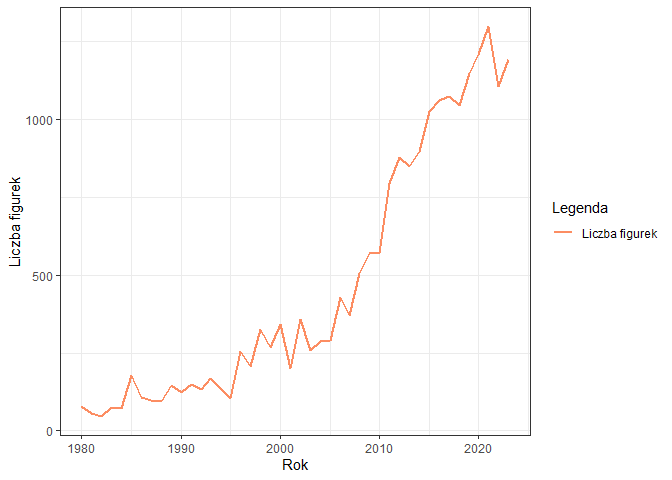

<style type="text/css">
.list-group-item.active, .list-group-item.active:focus, .list-group-item.active:hover {
  background-color: #8da0cb;
  border-color: #8da0cb;
}
</style>

# Executive summary

# Powtarzalność wyników

Dla zapewnienia powtarzalności wyników przy każdym uruchomieniu raportu dla tych samych danych, ustawiono ziarno dla generatora liczb pseudolosowych.


```r
set.seed(23)
```

# Wykorzystane biblioteki
Raport został stworzony przy wykorzystaniu następujących bibliotek.


```r
library(dplyr)
library(ggplot2)
```

# Kod odpowiedzialny za wczytanie danych z plików


```r
colors <- read.csv("dataset/colors.csv")
parts_cat <- read.csv("dataset/part_categories.csv")
elements <- read.csv("dataset/elements.csv")
parts <- read.csv("dataset/parts.csv")
inv_parts <- read.csv("dataset/inventory_parts.csv")

figs <- read.csv("dataset/minifigs.csv")
inv_figs <- read.csv("dataset/inventory_minifigs.csv")

themes <- read.csv("dataset/themes.csv")
sets <- read.csv("dataset/sets.csv")
inv_sets <- read.csv("dataset/inventory_sets.csv")

inventories <- read.csv("dataset/inventories.csv")
```

# Oczyszczenie i przetwarzanie danych
Ta sekcja poświęcona jest przetworzeniu brakujących wartości oraz transformacji wykorzystanych zbiorów danych.

## Zestawy Lego
Pierwsza i bardzo ważna część badanego zbioru danych. Zawierają się tutaj informacje o zestawach Lego, takie jak rok wydania oraz ilość części w zestawie, ale też lata w jakich dany zestaw zadebiutował na rynku. 


```r
themes <- setNames(themes, c("theme_id", "theme_name", "parent_id"))
colnames(sets)[colnames(sets) == "name"] <- "set_name"
colnames(sets)[colnames(sets) == "num_parts"] <- "set_num_parts"
colnames(inv_sets)[colnames(inv_sets) == "quantity"] <- "set_qty"

sets_with_themes <- themes %>%
  merge(sets, by = "theme_id") %>%
  select(-c("theme_id","img_url","parent_id"))
```

### Analiza atrybutów
Na wykresach można zaobserwować pewien trend. Wskazuje on na to, że wraz z upływem czasu powstaje coraz więcej zestawów Lego. Dodatkowo są one coraz większe i bardziej rozbudowane, na co wskazuje rosnąca liczba części.


```r
unique_theme_data <- sets_with_themes %>%
    group_by(year) %>%
    filter(year >= 1980) %>%
    filter(year <= 2023) %>%
    summarise(unique_theme = n_distinct(theme_name, na.rm = TRUE))

ggplot(unique_theme_data , aes(x = year, y = unique_theme)) +
    geom_line(aes(y = unique_theme, color = "Unikalne tematyki zestawów")) +
    labs(x = "Rok", y = "Liczba tematyk", colour = "Legenda") +
    scale_color_manual(values=c("#fc8d62")) +
    theme_bw()
```

<!-- -->

```r
mean_nparts_data <- sets_with_themes %>%
    group_by(year) %>%
    filter(year >= 1980) %>%
    filter(year <= 2023) %>%
    summarise(mean_nparts = mean(set_num_parts, na.rm = TRUE))

ggplot(mean_nparts_data , aes(x = year, y = mean_nparts)) +
    ggtitle("Średnia liczba części w zestawach w latach 1980-2023") +
    geom_bar(stat="identity", fill = "#fc8d62") +
    labs(x = "Rok", y = "Liczba części") +
    theme_bw()
```

<!-- -->

### Podsumowanie zbioru


```r
knitr::kable(summary(sets_with_themes), caption = "Podstawowe statystyki - zestawy Lego")
```


Table: Podstawowe statystyki - zestawy Lego

|   | theme_name      |  set_num        |  set_name       |     year    |set_num_parts   |
|:--|:----------------|:----------------|:----------------|:------------|:---------------|
|   |Length:21880     |Length:21880     |Length:21880     |Min.   :1949 |Min.   :    0.0 |
|   |Class :character |Class :character |Class :character |1st Qu.:2001 |1st Qu.:    3.0 |
|   |Mode  :character |Mode  :character |Mode  :character |Median :2012 |Median :   31.0 |
|   |                 |                 |                 |Mean   :2008 |Mean   :  161.4 |
|   |                 |                 |                 |3rd Qu.:2018 |3rd Qu.:  139.0 |
|   |                 |                 |                 |Max.   :2024 |Max.   :11695.0 |

## Figurki Lego
Kolejna część badanego zbioru danych. Możemy znaleźć tutaj informacje o figurkach m.in. z czego się one składają.  


```r
colnames(figs)[colnames(figs) == "name"] <- "fig_name"
colnames(figs)[colnames(figs) == "num_parts"] <- "fig_num_parts"
colnames(inv_figs)[colnames(inv_figs) == "quantity"] <- "fig_qty"
colnames(inventories)[colnames(inventories) == "id"] <- "inventory_id"

inventory_minifigures <- inv_figs %>%
     merge(figs, by = "fig_num") %>%
     merge(inventories, by = "inventory_id") %>%
     merge(sets, by = "set_num") %>%
     select(-c(1:2, 7:9, 11:13))
```

### Analiza atrybutów
Jeśli chodzi o ilość wykorzystywanych w zestawach figurek, to możemy zauważyć, że z czasem wykorzystywane są one coraz częściej.


```r
figures_number <- inventory_minifigures  %>%
    group_by(year) %>%
    filter(year >= 1980) %>%
    filter(year <= 2023) %>%
    summarise(fig_count = n())

ggplot(figures_number , aes(x = year, y = fig_count)) +
     geom_line(aes(y = fig_count, color = "Liczba figurek")) +
     labs(x = "Rok", y = "Liczba figurek", colour = "Legenda") +
     scale_color_manual(values=c("#fc8d62")) +
     theme_bw()
```

<!-- -->

### Podsumowanie zbioru


```r
knitr::kable(summary(inventory_minifigures), caption = "Podstawowe statystyki - figurki Lego")
```


Table: Podstawowe statystyki - figurki Lego

|   |  fig_num        |   fig_qty      |  fig_name       |fig_num_parts   |     year    |
|:--|:----------------|:---------------|:----------------|:---------------|:------------|
|   |Length:20858     |Min.   :  1.000 |Length:20858     |Min.   :  0.000 |Min.   :1975 |
|   |Class :character |1st Qu.:  1.000 |Class :character |1st Qu.:  4.000 |1st Qu.:2006 |
|   |Mode  :character |Median :  1.000 |Mode  :character |Median :  4.000 |Median :2014 |
|   |                 |Mean   :  1.062 |                 |Mean   :  4.813 |Mean   :2011 |
|   |                 |3rd Qu.:  1.000 |                 |3rd Qu.:  5.000 |3rd Qu.:2019 |
|   |                 |Max.   :100.000 |                 |Max.   :143.000 |Max.   :2023 |

## Części Lego
Ostatania część badanego zestawu danych zawiera informacje na temat części Lego. Znajdują się tutaj szczegóły poszczególnych części: elementy z których się składają, kolory, materiał z którego zostały wykonane oraz kategoria do której przynależą.


```r
colnames(parts)[colnames(parts) == "name"] <- "part_name"
colnames(parts_cat)[colnames(parts_cat) == "name"] <- "part_cat_name"
colnames(parts_cat)[colnames(parts_cat) == "id"] <- "part_cat_id"
colnames(colors)[colnames(colors) == "name"] <- "color_name"
colnames(colors)[colnames(colors) == "id"] <- "color_id"
colnames(inv_parts)[colnames(inv_parts) == "quantity"] <- "part_qty"

element_counts <- elements %>%
  group_by(part_num, color_id) %>%
  summarise(element_count = n())

inventory_parts <- inv_parts %>%
  merge(parts, by = "part_num") %>%
  merge(colors, by = "color_id") %>%
  merge(parts_cat, by = "part_cat_id") %>%
  merge(element_counts, by = c("part_num", "color_id")) %>%
  merge(inventories, by = "inventory_id") %>%
  merge(sets, by = "set_num") %>%
  select(-c(1:2, 4, 7:8, 12, 16:17, 19:21))
```

### Analiza atrybutów
W przypadku części Lego również można dostrzeć pewne trendy. Wykorzystywane elementy są coraz bardzie zróżnicowane, poprzez tworzenie części z nowych materiałów oraz w nowych kolorach. Warte wyróżnienia jest że złożoność części się nie zmieniła (na jedną część średnio przypada 1.5 elementu)


```r
transparent_parts <- inventory_parts %>%
    group_by(is_trans) %>%
    filter(year >= 1980) %>%
    filter(year <= 2023) %>%
    summarise(count = n())

ggplot(transparent_parts, aes(x=is_trans, y=count, fill=is_trans)) + 
  geom_bar(stat="identity", position="dodge") +
  scale_fill_manual(values = c("t" = "#66c2a5", "f" = "#fc8d62"), labels = c("TAK", "NIE")) +
  scale_x_discrete(labels = c("t" = "TAK", "f" = "NIE")) +
  labs(title = "Zestawienie kolorów (transparentność)", x = "Transparentność", y = "Liczba obserwacji", fill = "Legenda")
```

<!-- -->

```r
unique_data <- inventory_parts %>%
    filter(year >= 1980) %>%
    filter(year <= 2023) %>%
    group_by(year, part_material) %>%
    summarise(count = n(), type = "Material") %>%
    bind_rows(
        inventory_parts %>%
            group_by(year, color_name) %>%
            summarise(count = n(), type = "Color") %>%
            bind_rows(
                inventory_parts %>%
                    group_by(year, part_cat_name) %>%
                    summarise(count = n(), type = "Category")
            )
    )

ggplot(unique_data, aes(x = year, y = count, fill = type)) +
  geom_bar(stat = "identity", position = "dodge") +
  facet_grid(type ~ ., scales = "free_y", labeller = labeller(type = c("Material" = "Materiały", "Color" = "Kolory", "Category" = "Kategorie"))) +
  scale_fill_manual(values = c("Category" = "#66c2a5", "Color" = "#fc8d62", "Material" = "#8da0cb"), labels = c("Kategorie", "Kolory", "Materiały")) +
  labs(x = "Rok", y = "Liczba obserwacji", fill = "Legenda") +
  theme_bw()
```

<!-- -->

```r
elements_count <- inventory_parts %>%
  group_by(year) %>%
  filter(year >= 1980) %>%
  filter(year <= 2023) %>%
  summarise(el_count = mean(element_count, na.rm = TRUE))

ggplot(elements_count  , aes(x = year, y = el_count)) +
  geom_line(aes(color = "Średnia ilość elementów w częściach")) +
  labs(x = "Rok", y = "Liczba elementów", colour = "Legenda") +
  scale_color_manual(values=c("#fc8d62")) +
  theme_bw()
```

<!-- -->

### Podsumowanie zbioru


```r
knitr::kable(summary(inventory_parts), caption = "Podstawowe statystyki - części Lego")
```


Table: Podstawowe statystyki - części Lego

|   |  part_num       | part_cat_id  |   part_qty      | part_name       |part_material    | color_name      |  is_trans       |part_cat_name    |element_count |     year    |
|:--|:----------------|:-------------|:----------------|:----------------|:----------------|:----------------|:----------------|:----------------|:-------------|:------------|
|   |Length:1040218   |Min.   : 1.00 |Min.   :   1.000 |Length:1040218   |Length:1040218   |Length:1040218   |Length:1040218   |Length:1040218   |Min.   :1.000 |Min.   :1954 |
|   |Class :character |1st Qu.:11.00 |1st Qu.:   1.000 |Class :character |Class :character |Class :character |Class :character |Class :character |1st Qu.:1.000 |1st Qu.:2008 |
|   |Mode  :character |Median :15.00 |Median :   2.000 |Mode  :character |Mode  :character |Mode  :character |Mode  :character |Mode  :character |Median :1.000 |Median :2016 |
|   |                 |Mean   :21.73 |Mean   :   3.566 |                 |                 |                 |                 |                 |Mean   :1.591 |Mean   :2013 |
|   |                 |3rd Qu.:28.00 |3rd Qu.:   4.000 |                 |                 |                 |                 |                 |3rd Qu.:2.000 |3rd Qu.:2020 |
|   |                 |Max.   :68.00 |Max.   :3064.000 |                 |                 |                 |                 |                 |Max.   :9.000 |Max.   :2023 |

## Połączenie danych


