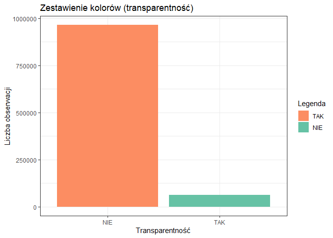
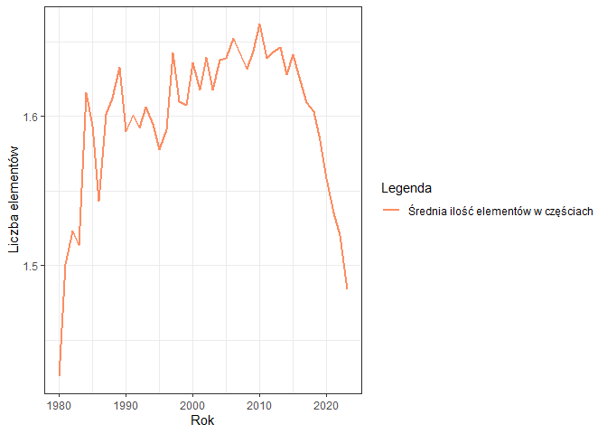
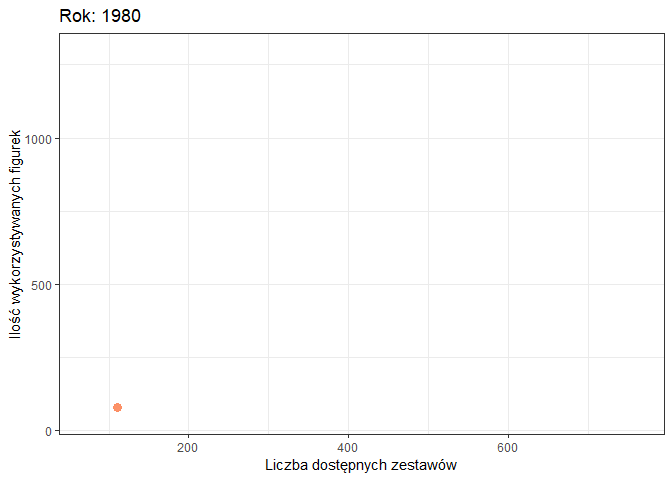

<style type="text/css">
.list-group-item.active, .list-group-item.active:focus, .list-group-item.active:hover {
  background-color: #8da0cb;
  border-color: #8da0cb;
}
</style>

# Executive summary

# Powtarzalność wyników

Dla zapewnienia powtarzalności wyników przy każdym uruchomieniu raportu dla tych samych danych, ustawiono ziarno dla generatora liczb pseudolosowych.


```r
set.seed(23)
```

# Wykorzystane biblioteki
Raport został stworzony przy wykorzystaniu następujących bibliotek.


```r
library(dplyr)
library(ggplot2)
library(tidyr)
library(tibble)
library(plotly)
library(gganimate)
library(caret)
library(randomForest)
```

# Kod odpowiedzialny za wczytanie danych z plików


```r
colors <- read.csv("dataset/colors.csv")
parts_cat <- read.csv("dataset/part_categories.csv")
elements <- read.csv("dataset/elements.csv")
parts <- read.csv("dataset/parts.csv")
inv_parts <- read.csv("dataset/inventory_parts.csv")

figs <- read.csv("dataset/minifigs.csv")
inv_figs <- read.csv("dataset/inventory_minifigs.csv")

themes <- read.csv("dataset/themes.csv")
sets <- read.csv("dataset/sets.csv")
inv_sets <- read.csv("dataset/inventory_sets.csv")

inventories <- read.csv("dataset/inventories.csv")
```

# Oczyszczenie i przetwarzanie danych
Ta sekcja poświęcona jest przetworzeniu brakujących wartości oraz transformacji wykorzystanych zbiorów danych.

## Zestawy Lego
Pierwsza i bardzo ważna część badanego zbioru danych. Zawierają się tutaj informacje o zestawach Lego, takie jak: rok wydania oraz ilość części w zestawie, ale też lata w jakich dany zestaw zadebiutował na rynku. 


```r
themes <- setNames(themes, c("theme_id", "theme_name", "parent_id"))
colnames(sets)[colnames(sets) == "name"] <- "set_name"
colnames(sets)[colnames(sets) == "num_parts"] <- "set_num_parts"
colnames(inv_sets)[colnames(inv_sets) == "quantity"] <- "set_qty"

sets_with_themes <- themes %>%
  merge(sets, by = "theme_id") %>%
  select(-c("theme_id","img_url","parent_id"))
```

### Analiza atrybutów
Na wykresach można zaobserwować pewien trend. Wskazuje on na to, że wraz z upływem czasu powstaje coraz więcej zestawów Lego. Dodatkowo są one coraz większe i bardziej rozbudowane, na co wskazuje rosnąca liczba części.


```r
unique_theme_data <- sets_with_themes %>%
    group_by(year) %>%
    filter(year >= 1980) %>%
    filter(year <= 2023) %>%
    summarise(unique_theme = n_distinct(theme_name, na.rm = TRUE))

ggplot(unique_theme_data , aes(x = year, y = unique_theme)) +
    geom_line(aes(y = unique_theme, color = "Unikalne tematyki zestawów"), size = 1) +
    labs(x = "Rok", y = "Liczba tematyk", colour = "Legenda") +
    scale_color_manual(values=c("#fc8d62")) +
    theme_bw()
```

<!-- -->

```r
mean_nparts_data <- sets_with_themes %>%
    group_by(year) %>%
    filter(year >= 1980) %>%
    filter(year <= 2023) %>%
    summarise(sets_mean_nparts = mean(set_num_parts, na.rm = TRUE), sets_count = n())

ggplot(mean_nparts_data , aes(x = year, y = sets_mean_nparts)) +
    ggtitle("Średnia liczba części w zestawach w latach 1980-2023") +
    geom_bar(stat="identity", fill = "#fc8d62") +
    labs(x = "Rok", y = "Liczba części") +
    theme_bw()
```

<!-- -->

### Podsumowanie zbioru


```r
knitr::kable(summary(sets_with_themes), caption = "Podstawowe statystyki - zestawy Lego")
```


Table: Podstawowe statystyki - zestawy Lego

|   | theme_name      |  set_num        |  set_name       |     year    |set_num_parts   |
|:--|:----------------|:----------------|:----------------|:------------|:---------------|
|   |Length:21880     |Length:21880     |Length:21880     |Min.   :1949 |Min.   :    0.0 |
|   |Class :character |Class :character |Class :character |1st Qu.:2001 |1st Qu.:    3.0 |
|   |Mode  :character |Mode  :character |Mode  :character |Median :2012 |Median :   31.0 |
|   |                 |                 |                 |Mean   :2008 |Mean   :  161.4 |
|   |                 |                 |                 |3rd Qu.:2018 |3rd Qu.:  139.0 |
|   |                 |                 |                 |Max.   :2024 |Max.   :11695.0 |

## Figurki Lego
Kolejna część badanego zbioru danych. Możemy znaleźć tutaj informacje o figurkach m.in. z czego się one składają.  


```r
colnames(figs)[colnames(figs) == "name"] <- "fig_name"
colnames(figs)[colnames(figs) == "num_parts"] <- "fig_num_parts"
colnames(inv_figs)[colnames(inv_figs) == "quantity"] <- "fig_qty"
colnames(inventories)[colnames(inventories) == "id"] <- "inventory_id"

inventory_minifigures <- inv_figs %>%
     merge(figs, by = "fig_num") %>%
     merge(inventories, by = "inventory_id") %>%
     merge(sets, by = "set_num") %>%
     select(-c(1:2, 7:9, 11:13))
```

### Analiza atrybutów
Jeśli chodzi o ilość wykorzystywanych w zestawach figurek to możemy zauważyć, że z czasem wykorzystywane są one coraz częściej.


```r
figures_number <- inventory_minifigures  %>%
    group_by(year) %>%
    filter(year >= 1980) %>%
    filter(year <= 2023) %>%
    summarise(fig_count = n())

ggplot(figures_number , aes(x = year, y = fig_count)) +
     geom_line(aes(y = fig_count, color = "Liczba figurek"), size = 1) +
     labs(x = "Rok", y = "Liczba figurek", colour = "Legenda") +
     scale_color_manual(values=c("#fc8d62")) +
     theme_bw()
```

<!-- -->

### Podsumowanie zbioru


```r
knitr::kable(summary(inventory_minifigures), caption = "Podstawowe statystyki - figurki Lego")
```


Table: Podstawowe statystyki - figurki Lego

|   |  fig_num        |   fig_qty      |  fig_name       |fig_num_parts   |     year    |
|:--|:----------------|:---------------|:----------------|:---------------|:------------|
|   |Length:20858     |Min.   :  1.000 |Length:20858     |Min.   :  0.000 |Min.   :1975 |
|   |Class :character |1st Qu.:  1.000 |Class :character |1st Qu.:  4.000 |1st Qu.:2006 |
|   |Mode  :character |Median :  1.000 |Mode  :character |Median :  4.000 |Median :2014 |
|   |                 |Mean   :  1.062 |                 |Mean   :  4.813 |Mean   :2011 |
|   |                 |3rd Qu.:  1.000 |                 |3rd Qu.:  5.000 |3rd Qu.:2019 |
|   |                 |Max.   :100.000 |                 |Max.   :143.000 |Max.   :2023 |

## Części Lego
Ostatania część badanego zestawu danych zawiera informacje na temat części Lego. Znajdują się tutaj szczegóły poszczególnych części: elementy z których się składają, kolory, materiał z którego zostały wykonane oraz kategoria do której przynależą.


```r
colnames(parts)[colnames(parts) == "name"] <- "part_name"
colnames(parts_cat)[colnames(parts_cat) == "name"] <- "part_cat_name"
colnames(parts_cat)[colnames(parts_cat) == "id"] <- "part_cat_id"
colnames(colors)[colnames(colors) == "name"] <- "color_name"
colnames(colors)[colnames(colors) == "id"] <- "color_id"
colnames(inv_parts)[colnames(inv_parts) == "quantity"] <- "part_qty"

element_counts <- elements %>%
  group_by(part_num, color_id) %>%
  summarise(el_per_part = n())

inventory_parts <- inv_parts %>%
  merge(parts, by = "part_num") %>%
  merge(colors, by = "color_id") %>%
  merge(parts_cat, by = "part_cat_id") %>%
  merge(element_counts, by = c("part_num", "color_id")) %>%
  merge(inventories, by = "inventory_id") %>%
  merge(sets, by = "set_num") %>%
  select(-c(1:2, 4, 7:8, 12, 16:17, 19:21))
```

### Analiza atrybutów
W przypadku części Lego również można dostrzeć pewne trendy. Wykorzystywane elementy są coraz bardziej zróżnicowane, poprzez tworzenie części z nowych materiałów oraz w nowych kolorach. Warte wyróżnienia jest, że złożoność części się nie zmieniła (na jedną część średnio przypada 1.5 elementu)


```r
transparent_parts <- inventory_parts %>%
    group_by(is_trans) %>%
    filter(year >= 1980) %>%
    filter(year <= 2023) %>%
    summarise(trans_part_count = n())

ggplot(transparent_parts, aes(x=is_trans, y=trans_part_count, fill=is_trans)) + 
  geom_bar(stat="identity", position="dodge") +
  scale_fill_manual(values = c("t" = "#66c2a5", "f" = "#fc8d62"), labels = c("TAK", "NIE")) +
  scale_x_discrete(labels = c("t" = "TAK", "f" = "NIE")) +
  labs(title = "Zestawienie kolorów (transparentność)", x = "Transparentność", y = "Liczba obserwacji", fill = "Legenda") +
  theme_bw()
```

<!-- -->

```r
unique_data <- inventory_parts %>%
    filter(year >= 1980) %>%
    filter(year <= 2023) %>%
    group_by(year, part_material) %>%
    summarise(count = n(), type = "Material") %>%
    bind_rows(
        inventory_parts %>%
            group_by(year, color_name) %>%
            summarise(count = n(), type = "Color") %>%
            bind_rows(
                inventory_parts %>%
                    group_by(year, part_cat_name) %>%
                    summarise(count = n(), type = "Category")
            )
    )

ggplot(unique_data, aes(x = year, y = count, fill = type)) +
  geom_bar(stat = "identity", position = "dodge") +
  facet_grid(type ~ ., scales = "free_y", labeller = labeller(type = c("Material" = "Materiały", "Color" = "Kolory", "Category" = "Kategorie"))) +
  scale_fill_manual(values = c("Category" = "#66c2a5", "Color" = "#fc8d62", "Material" = "#8da0cb"), labels = c("Kategorie", "Kolory", "Materiały")) +
  labs(x = "Rok", y = "Liczba obserwacji", fill = "Legenda") +
  theme_bw()
```

<!-- -->

```r
elements_count <- inventory_parts %>%
  group_by(year) %>%
  filter(year >= 1980) %>%
  filter(year <= 2023) %>%
  summarise(el_in_part = mean(el_per_part, na.rm = TRUE))

ggplot(elements_count  , aes(x = year, y = el_in_part)) +
  geom_line(aes(color = "Średnia ilość elementów w częściach"), size = 1) +
  labs(x = "Rok", y = "Liczba elementów", colour = "Legenda") +
  scale_color_manual(values=c("#fc8d62")) +
  theme_bw()
```

<!-- -->

### Podsumowanie zbioru


```r
knitr::kable(summary(inventory_parts), caption = "Podstawowe statystyki - części Lego")
```


Table: Podstawowe statystyki - części Lego

|   |  part_num       | part_cat_id  |   part_qty      | part_name       |part_material    | color_name      |  is_trans       |part_cat_name    | el_per_part  |     year    |
|:--|:----------------|:-------------|:----------------|:----------------|:----------------|:----------------|:----------------|:----------------|:-------------|:------------|
|   |Length:1040218   |Min.   : 1.00 |Min.   :   1.000 |Length:1040218   |Length:1040218   |Length:1040218   |Length:1040218   |Length:1040218   |Min.   :1.000 |Min.   :1954 |
|   |Class :character |1st Qu.:11.00 |1st Qu.:   1.000 |Class :character |Class :character |Class :character |Class :character |Class :character |1st Qu.:1.000 |1st Qu.:2008 |
|   |Mode  :character |Median :15.00 |Median :   2.000 |Mode  :character |Mode  :character |Mode  :character |Mode  :character |Mode  :character |Median :1.000 |Median :2016 |
|   |                 |Mean   :21.73 |Mean   :   3.566 |                 |                 |                 |                 |                 |Mean   :1.591 |Mean   :2013 |
|   |                 |3rd Qu.:28.00 |3rd Qu.:   4.000 |                 |                 |                 |                 |                 |3rd Qu.:2.000 |3rd Qu.:2020 |
|   |                 |Max.   :68.00 |Max.   :3064.000 |                 |                 |                 |                 |                 |Max.   :9.000 |Max.   :2023 |

## Połączenie danych


```r
dataset <- unique_theme_data %>%
  merge(mean_nparts_data) %>%
  merge(figures_number) %>%
  merge(transparent_parts) %>%
  merge(elements_count)
```

# Podsumowanie badanego zbioru


```r
knitr::kable(summary(dataset))
```


|   |     year    | unique_theme |sets_mean_nparts |  sets_count   |  fig_count    |  is_trans       |trans_part_count |  el_in_part  |
|:--|:------------|:-------------|:----------------|:--------------|:--------------|:----------------|:----------------|:-------------|
|   |Min.   :1980 |Min.   :14.00 |Min.   : 66.47   |Min.   :  74.0 |Min.   :  48.0 |Length:88        |Min.   : 61982   |Min.   :1.426 |
|   |1st Qu.:1991 |1st Qu.:24.00 |1st Qu.:102.28   |1st Qu.: 157.5 |1st Qu.: 135.2 |Class :character |1st Qu.: 61982   |1st Qu.:1.588 |
|   |Median :2002 |Median :56.00 |Median :131.77   |Median : 420.0 |Median : 289.0 |Mode  :character |Median :513352   |Median :1.610 |
|   |Mean   :2002 |Mean   :53.66 |Mean   :140.95   |Mean   : 468.8 |Mean   : 468.2 |                 |Mean   :513352   |Mean   :1.598 |
|   |3rd Qu.:2012 |3rd Qu.:79.75 |3rd Qu.:171.05   |3rd Qu.: 729.5 |3rd Qu.: 855.5 |                 |3rd Qu.:964721   |3rd Qu.:1.638 |
|   |Max.   :2023 |Max.   :96.00 |Max.   :307.83   |Max.   :1149.0 |Max.   :1301.0 |                 |Max.   :964721   |Max.   :1.662 |

## Trend w rozwoju LEGO
W tej sekcji przedstawiono jak na przestrzeni lat (1980-2023) zmieniały się trendy w Lego. Uwzględniono zmiany w złożoności zestawów (średniej liczby wykorzystywanych w nich części) poprzez wielkość punktu, w porównaniu z ilością wykorzystywanych w zestawach figurek oraz liczby dostępnych zestawów. 

Na podstawie wykresu możemy zauważyć, że największy przeskok jeśli chodzi o zaawansowanie zestawów (ich ilość i złożoność), przypada na okres około 2010 roku.


```r
animation <- dataset %>% 
  select(year, sets_count, fig_count, sets_mean_nparts)

p <- ggplot(animation, aes(x=sets_count, y=fig_count, size = sets_mean_nparts)) +
    geom_point(show.legend = FALSE, alpha = 0.8, color = "#fc8d62") +
    labs(title = 'Rok: {frame_time}', x = "Liczba dostępnych zestawów", y = "Ilość wykorzystywanych figurek") +
    transition_time(year) +
    theme_bw()

animate(p, nframes = 225)
```

<!-- -->

# Wyznaczenie korelacji
Na poniższym wykresie przedstawiona została wartość współczynnika korelacji Pearsona między parametrami atrybutów w zbiorze.


```{=html}
<div class="plotly html-widget html-fill-item-overflow-hidden html-fill-item" id="htmlwidget-9c1bf7f2c778aa662c21" style="width:100%;height:480px;"></div>
<script type="application/json" data-for="htmlwidget-9c1bf7f2c778aa662c21">{"x":{"data":[{"x":[1,2,3,4,5,6,7],"y":[1,2,3,4,5,6,7],"z":[[1,0.14218873557321379,0.20927066360890353,0,0.11881863943315966,0.387721081713853,0.34260948004439268],[0.14218873557321379,1,0.97141883495986603,0.79346233436427227,0.11881863943315966,0.91785319661314968,0.93606866059544813],[0.20927066360890353,0.97141883495986603,1,0.7391155932029545,0.11881863943315966,0.95129243283616982,0.9539186731767616],[0,0.79346233436427227,0.7391155932029545,1,0.11881863943315966,0.7089079769694101,0.81214818436174951],[0.11881863943315966,0.11881863943315966,0.11881863943315966,0.11881863943315966,1,0.11881863943315966,0.11881863943315966],[0.387721081713853,0.91785319661314968,0.95129243283616982,0.7089079769694101,0.11881863943315966,1,0.96831152069203796],[0.34260948004439268,0.93606866059544813,0.9539186731767616,0.81214818436174951,0.11881863943315966,0.96831152069203796,1]],"text":[["colname: el_in_part<br />rowname: el_in_part<br />value:  1.00000000","colname: fig_count<br />rowname: el_in_part<br />value:  0.02652132","colname: sets_count<br />rowname: el_in_part<br />value:  0.10264859","colname: sets_mean_nparts<br />rowname: el_in_part<br />value: -0.13484016","colname: trans_part_count<br />rowname: el_in_part<br />value:  0.00000000","colname: unique_theme<br />rowname: el_in_part<br />value:  0.30516129","colname: year<br />rowname: el_in_part<br />value:  0.25396683"],["colname: el_in_part<br />rowname: fig_count<br />value:  0.02652132","colname: fig_count<br />rowname: fig_count<br />value:  1.00000000","colname: sets_count<br />rowname: fig_count<br />value:  0.96756495","colname: sets_mean_nparts<br />rowname: fig_count<br />value:  0.76561276","colname: trans_part_count<br />rowname: fig_count<br />value:  0.00000000","colname: unique_theme<br />rowname: fig_count<br />value:  0.90677651","colname: year<br />rowname: fig_count<br />value:  0.92744815"],["colname: el_in_part<br />rowname: sets_count<br />value:  0.10264859","colname: fig_count<br />rowname: sets_count<br />value:  0.96756495","colname: sets_count<br />rowname: sets_count<br />value:  1.00000000","colname: sets_mean_nparts<br />rowname: sets_count<br />value:  0.70393790","colname: trans_part_count<br />rowname: sets_count<br />value:  0.00000000","colname: unique_theme<br />rowname: sets_count<br />value:  0.94472470","colname: year<br />rowname: sets_count<br />value:  0.94770506"],["colname: el_in_part<br />rowname: sets_mean_nparts<br />value: -0.13484016","colname: fig_count<br />rowname: sets_mean_nparts<br />value:  0.76561276","colname: sets_count<br />rowname: sets_mean_nparts<br />value:  0.70393790","colname: sets_mean_nparts<br />rowname: sets_mean_nparts<br />value:  1.00000000","colname: trans_part_count<br />rowname: sets_mean_nparts<br />value:  0.00000000","colname: unique_theme<br />rowname: sets_mean_nparts<br />value:  0.66965708","colname: year<br />rowname: sets_mean_nparts<br />value:  0.78681821"],["colname: el_in_part<br />rowname: trans_part_count<br />value:  0.00000000","colname: fig_count<br />rowname: trans_part_count<br />value:  0.00000000","colname: sets_count<br />rowname: trans_part_count<br />value:  0.00000000","colname: sets_mean_nparts<br />rowname: trans_part_count<br />value:  0.00000000","colname: trans_part_count<br />rowname: trans_part_count<br />value:  1.00000000","colname: unique_theme<br />rowname: trans_part_count<br />value:  0.00000000","colname: year<br />rowname: trans_part_count<br />value:  0.00000000"],["colname: el_in_part<br />rowname: unique_theme<br />value:  0.30516129","colname: fig_count<br />rowname: unique_theme<br />value:  0.90677651","colname: sets_count<br />rowname: unique_theme<br />value:  0.94472470","colname: sets_mean_nparts<br />rowname: unique_theme<br />value:  0.66965708","colname: trans_part_count<br />rowname: unique_theme<br />value:  0.00000000","colname: unique_theme<br />rowname: unique_theme<br />value:  1.00000000","colname: year<br />rowname: unique_theme<br />value:  0.96403864"],["colname: el_in_part<br />rowname: year<br />value:  0.25396683","colname: fig_count<br />rowname: year<br />value:  0.92744815","colname: sets_count<br />rowname: year<br />value:  0.94770506","colname: sets_mean_nparts<br />rowname: year<br />value:  0.78681821","colname: trans_part_count<br />rowname: year<br />value:  0.00000000","colname: unique_theme<br />rowname: year<br />value:  0.96403864","colname: year<br />rowname: year<br />value:  1.00000000"]],"colorscale":[[0,"#F1E0DE"],[0.11881863943315966,"#FFFFFF"],[0.14218873557321379,"#FAF9FC"],[0.20927066360890353,"#ECE9F4"],[0.34260948004439268,"#CFC9E5"],[0.387721081713853,"#C6BEE0"],[0.7089079769694101,"#8076BA"],[0.7391155932029545,"#7A6FB7"],[0.79346233436427227,"#6E64B0"],[0.81214818436174951,"#6960AE"],[0.91785319661314968,"#504AA2"],[0.93606866059544813,"#4B47A0"],[0.95129243283616982,"#47449E"],[0.9539186731767616,"#47439D"],[0.96831152069203796,"#43409C"],[0.97141883495986603,"#42409B"],[1,"#3A3A98"]],"type":"heatmap","showscale":false,"autocolorscale":false,"showlegend":false,"xaxis":"x","yaxis":"y","hoverinfo":"text","frame":null},{"x":[1],"y":[1],"name":"99_d2d60a57945ede1708cd9ce731a43c90","type":"scatter","mode":"markers","opacity":0,"hoverinfo":"skip","showlegend":false,"marker":{"color":[0,1],"colorscale":[[0,"#F1E0DE"],[0.0033444816053511735,"#F2E1DF"],[0.0066889632107023471,"#F2E2E0"],[0.010033444816053508,"#F3E3E1"],[0.013377926421404682,"#F3E4E2"],[0.016722408026755856,"#F3E5E3"],[0.020066889632107027,"#F4E5E4"],[0.023411371237458189,"#F4E6E4"],[0.026755852842809364,"#F5E7E5"],[0.030100334448160536,"#F5E8E6"],[0.033444816053511711,"#F5E9E7"],[0.036789297658862886,"#F6EAE8"],[0.040133779264214055,"#F6EBE9"],[0.043478260869565216,"#F6EBEA"],[0.046822742474916391,"#F7ECEB"],[0.050167224080267553,"#F7EDEC"],[0.053511705685618728,"#F8EEED"],[0.056856187290969896,"#F8EFEE"],[0.060200668896321072,"#F8F0EF"],[0.06354515050167224,"#F9F1F0"],[0.066889632107023422,"#F9F2F0"],[0.070234113712374577,"#FAF2F1"],[0.073578595317725759,"#FAF3F2"],[0.076923076923076927,"#FAF4F3"],[0.080267558528428096,"#FBF5F4"],[0.083612040133779278,"#FBF6F5"],[0.086956521739130432,"#FBF7F6"],[0.090301003344481615,"#FCF8F7"],[0.093645484949832783,"#FCF8F8"],[0.096989966555183951,"#FDF9F9"],[0.10033444816053512,"#FDFAFA"],[0.10367892976588629,"#FDFBFB"],[0.10702341137123747,"#FEFCFC"],[0.11036789297658862,"#FEFDFD"],[0.11371237458193979,"#FEFEFE"],[0.11705685618729098,"#FFFFFF"],[0.12040133779264214,"#FFFFFF"],[0.12374581939799333,"#FEFEFE"],[0.12709030100334448,"#FDFDFE"],[0.13043478260869568,"#FDFCFE"],[0.13377926421404684,"#FCFBFD"],[0.13712374581939801,"#FBFAFD"],[0.14046822742474915,"#FAFAFC"],[0.14381270903010032,"#FAF9FC"],[0.14715719063545152,"#F9F8FC"],[0.15050167224080269,"#F8F7FB"],[0.15384615384615385,"#F7F6FB"],[0.15719063545150502,"#F7F6FB"],[0.16053511705685619,"#F6F5FA"],[0.16387959866220739,"#F5F4FA"],[0.16722408026755856,"#F5F3F9"],[0.1705685618729097,"#F4F2F9"],[0.17391304347826086,"#F3F1F9"],[0.17725752508361203,"#F2F1F8"],[0.18060200668896323,"#F2F0F8"],[0.1839464882943144,"#F1EFF7"],[0.18729096989966557,"#F0EEF7"],[0.19063545150501673,"#F0EDF7"],[0.1939799331103679,"#EFEDF6"],[0.1973244147157191,"#EEECF6"],[0.20066889632107024,"#EDEBF5"],[0.20401337792642141,"#EDEAF5"],[0.20735785953177258,"#ECE9F5"],[0.21070234113712374,"#EBE9F4"],[0.21404682274247494,"#EBE8F4"],[0.21739130434782611,"#EAE7F4"],[0.22073578595317725,"#E9E6F3"],[0.22408026755852845,"#E8E5F3"],[0.22742474916387959,"#E8E4F2"],[0.23076923076923078,"#E7E4F2"],[0.23411371237458195,"#E6E3F2"],[0.23745819397993315,"#E6E2F1"],[0.24080267558528429,"#E5E1F1"],[0.24414715719063548,"#E4E0F0"],[0.24749163879598665,"#E3E0F0"],[0.25083612040133779,"#E3DFF0"],[0.25418060200668896,"#E2DEEF"],[0.25752508361204013,"#E1DDEF"],[0.26086956521739135,"#E1DCEE"],[0.26421404682274247,"#E0DCEE"],[0.26755852842809369,"#DFDBEE"],[0.2709030100334448,"#DEDAED"],[0.27424749163879603,"#DED9ED"],[0.27759197324414719,"#DDD8ED"],[0.28093645484949831,"#DCD8EC"],[0.28428093645484953,"#DCD7EC"],[0.28762541806020064,"#DBD6EB"],[0.29096989966555187,"#DAD5EB"],[0.29431438127090304,"#D9D4EB"],[0.2976588628762542,"#D9D4EA"],[0.30100334448160537,"#D8D3EA"],[0.30434782608695654,"#D7D2E9"],[0.30769230769230771,"#D7D1E9"],[0.31103678929765888,"#D6D0E9"],[0.31438127090301005,"#D5D0E8"],[0.31772575250836121,"#D4CFE8"],[0.32107023411371238,"#D4CEE7"],[0.32441471571906355,"#D3CDE7"],[0.32775919732441477,"#D2CCE7"],[0.33110367892976589,"#D2CCE6"],[0.33444816053511711,"#D1CBE6"],[0.33779264214046822,"#D0CAE6"],[0.34113712374581939,"#CFC9E5"],[0.34448160535117062,"#CFC8E5"],[0.34782608695652173,"#CEC8E4"],[0.35117056856187295,"#CDC7E4"],[0.35451505016722407,"#CDC6E4"],[0.35785953177257529,"#CCC5E3"],[0.36120401337792646,"#CBC4E3"],[0.36454849498327763,"#CAC4E2"],[0.3678929765886288,"#CAC3E2"],[0.37123745819397991,"#C9C2E2"],[0.37458193979933113,"#C8C1E1"],[0.3779264214046823,"#C8C1E1"],[0.38127090301003347,"#C7C0E0"],[0.38461538461538464,"#C6BFE0"],[0.38795986622073581,"#C5BEE0"],[0.39130434782608697,"#C5BDDF"],[0.3946488294314382,"#C4BDDF"],[0.39799331103678931,"#C3BCDF"],[0.40133779264214048,"#C3BBDE"],[0.40468227424749165,"#C2BADE"],[0.40802675585284282,"#C1BADD"],[0.41137123745819404,"#C0B9DD"],[0.41471571906354515,"#C0B8DD"],[0.41806020066889638,"#BFB7DC"],[0.42140468227424749,"#BEB6DC"],[0.42474916387959871,"#BEB6DB"],[0.42809364548494988,"#BDB5DB"],[0.43143812709030099,"#BCB4DB"],[0.43478260869565222,"#BBB3DA"],[0.43812709030100333,"#BBB3DA"],[0.4414715719063545,"#BAB2D9"],[0.44481605351170572,"#B9B1D9"],[0.44816053511705689,"#B9B0D9"],[0.45150501672240806,"#B8AFD8"],[0.45484949832775917,"#B7AFD8"],[0.45819397993311045,"#B6AED8"],[0.46153846153846156,"#B6ADD7"],[0.46488294314381273,"#B5ACD7"],[0.4682274247491639,"#B4ACD6"],[0.47157190635451501,"#B4ABD6"],[0.47491638795986629,"#B3AAD6"],[0.47826086956521746,"#B2A9D5"],[0.48160535117056857,"#B1A9D5"],[0.48494983277591974,"#B1A8D4"],[0.48829431438127097,"#B0A7D4"],[0.49163879598662213,"#AFA6D4"],[0.4949832775919733,"#AFA5D3"],[0.49832775919732442,"#AEA5D3"],[0.50167224080267558,"#ADA4D2"],[0.50501672240802686,"#ACA3D2"],[0.50836120401337792,"#ACA2D2"],[0.51170568561872909,"#ABA2D1"],[0.51505016722408026,"#AAA1D1"],[0.51839464882943154,"#AAA0D0"],[0.52173913043478271,"#A99FD0"],[0.52508361204013376,"#A89FD0"],[0.52842809364548493,"#A79ECF"],[0.5317725752508361,"#A79DCF"],[0.53511705685618738,"#A69CCF"],[0.53846153846153855,"#A59CCE"],[0.5418060200668896,"#A59BCE"],[0.54515050167224077,"#A49ACD"],[0.54849498327759205,"#A399CD"],[0.55183946488294322,"#A299CD"],[0.55518394648829439,"#A298CC"],[0.55852842809364545,"#A197CC"],[0.5618729096989965,"#A096CB"],[0.56521739130434789,"#A096CB"],[0.56856187290969906,"#9F95CB"],[0.57190635451505023,"#9E94CA"],[0.57525083612040129,"#9D93CA"],[0.57859531772575246,"#9D93C9"],[0.58193979933110362,"#9C92C9"],[0.58528428093645479,"#9B91C9"],[0.58862876254180596,"#9B90C8"],[0.59197324414715713,"#9A90C8"],[0.59531772575250841,"#998FC8"],[0.59866220735785958,"#988EC7"],[0.60200668896321075,"#988DC7"],[0.60535117056856191,"#978DC6"],[0.60869565217391297,"#968CC6"],[0.61204013377926414,"#958BC6"],[0.61538461538461531,"#958AC5"],[0.61872909698996648,"#948AC5"],[0.62207357859531764,"#9389C4"],[0.62541806020066892,"#9388C4"],[0.62876254180602009,"#9287C4"],[0.63210702341137126,"#9187C3"],[0.63545150501672243,"#9086C3"],[0.6387959866220736,"#9085C2"],[0.64214046822742477,"#8F84C2"],[0.64548494983277582,"#8E84C2"],[0.64882943143812699,"#8E83C1"],[0.65217391304347816,"#8D82C1"],[0.65551839464882955,"#8C81C0"],[0.65886287625418061,"#8B81C0"],[0.66220735785953178,"#8B80C0"],[0.66555183946488294,"#8A7FBF"],[0.66889632107023411,"#897FBF"],[0.67224080267558528,"#887EBE"],[0.67558528428093645,"#887DBE"],[0.67892976588628751,"#877CBE"],[0.68227424749163867,"#867CBD"],[0.68561872909699006,"#857BBD"],[0.68896321070234123,"#857ABD"],[0.69230769230769229,"#8479BC"],[0.69565217391304346,"#8379BC"],[0.69899665551839463,"#8378BB"],[0.7023411371237458,"#8277BB"],[0.70568561872909696,"#8177BB"],[0.70903010033444813,"#8076BA"],[0.71237458193979919,"#8075BA"],[0.71571906354515058,"#7F74B9"],[0.71906354515050175,"#7E74B9"],[0.72240802675585292,"#7D73B9"],[0.72575250836120397,"#7D72B8"],[0.72909698996655514,"#7C72B8"],[0.73244147157190631,"#7B71B7"],[0.73578595317725748,"#7A70B7"],[0.73913043478260865,"#7A6FB7"],[0.74247491638795982,"#796FB6"],[0.7458193979933111,"#786EB6"],[0.74916387959866226,"#776DB5"],[0.75250836120401343,"#776CB5"],[0.7558528428093646,"#766CB5"],[0.75919732441471566,"#756BB4"],[0.76254180602006683,"#746AB4"],[0.76588628762541799,"#746AB4"],[0.76923076923076916,"#7369B3"],[0.77257525083612033,"#7268B3"],[0.77591973244147161,"#7168B2"],[0.77926421404682278,"#7167B2"],[0.78260869565217395,"#7066B2"],[0.78595317725752512,"#6F65B1"],[0.78929765886287628,"#6E65B1"],[0.79264214046822734,"#6E64B0"],[0.79598662207357851,"#6D63B0"],[0.79933110367892968,"#6C63B0"],[0.80267558528428085,"#6B62AF"],[0.80602006688963224,"#6B61AF"],[0.80936454849498329,"#6A60AE"],[0.81270903010033446,"#6960AE"],[0.81605351170568563,"#685FAE"],[0.8193979933110368,"#685EAD"],[0.82274247491638797,"#675EAD"],[0.82608695652173902,"#665DAC"],[0.82943143812709019,"#655CAC"],[0.83277591973244136,"#645CAC"],[0.83612040133779275,"#645BAB"],[0.83946488294314392,"#635AAB"],[0.84280936454849498,"#625AAA"],[0.84615384615384615,"#6159AA"],[0.84949832775919731,"#6158AA"],[0.85284280936454848,"#6057A9"],[0.85618729096989965,"#5F57A9"],[0.85953177257525082,"#5E56A9"],[0.86287625418060188,"#5D55A8"],[0.86622073578595327,"#5D55A8"],[0.86956521739130443,"#5C54A7"],[0.8729096989966556,"#5B53A7"],[0.87625418060200666,"#5A53A7"],[0.87959866220735783,"#5952A6"],[0.882943143812709,"#5951A6"],[0.88628762541806039,"#5851A5"],[0.88963210702341144,"#5750A5"],[0.89297658862876261,"#564FA5"],[0.89632107023411378,"#554FA4"],[0.89966555183946495,"#554EA4"],[0.90301003344481612,"#544DA3"],[0.90635451505016729,"#534DA3"],[0.90969899665551834,"#524CA3"],[0.91304347826086951,"#514BA2"],[0.9163879598662209,"#504BA2"],[0.91973244147157207,"#504AA1"],[0.92307692307692313,"#4F49A1"],[0.9264214046822743,"#4E49A1"],[0.92976588628762546,"#4D48A0"],[0.93311036789297663,"#4C47A0"],[0.9364548494983278,"#4B479F"],[0.93979933110367897,"#4A469F"],[0.94314381270903003,"#4A459F"],[0.94648829431438142,"#49459E"],[0.94983277591973259,"#48449E"],[0.95317725752508375,"#47439E"],[0.95652173913043492,"#46439D"],[0.95986622073578598,"#45429D"],[0.96321070234113715,"#44419C"],[0.96655518394648832,"#43419C"],[0.96989966555183948,"#42409C"],[0.97324414715719065,"#423F9B"],[0.97658862876254193,"#413F9B"],[0.9799331103678931,"#403E9A"],[0.98327759197324427,"#3F3D9A"],[0.98662207357859544,"#3E3D9A"],[0.98996655518394661,"#3D3C99"],[0.99331103678929766,"#3C3B99"],[0.99665551839464883,"#3B3B98"],[1,"#3A3A98"]],"colorbar":{"bgcolor":"rgba(255,255,255,1)","bordercolor":"transparent","borderwidth":1.8897637795275593,"thickness":23.039999999999996,"title":"Wartość współczynnika korelacji Pearsona","titlefont":{"color":"rgba(0,0,0,1)","family":"","size":14.611872146118724},"tickmode":"array","ticktext":["0.00","0.25","0.50","0.75","1.00"],"tickvals":[0.11881863943315966,0.33911397957486977,0.55940931971657981,0.77970465985828985,1],"tickfont":{"color":"rgba(0,0,0,1)","family":"","size":11.68949771689498},"ticklen":2,"len":0.5}},"xaxis":"x","yaxis":"y","frame":null}],"layout":{"margin":{"t":43.762557077625573,"r":7.3059360730593621,"b":78.001461475914198,"l":119.08675799086761},"plot_bgcolor":"rgba(235,235,235,1)","paper_bgcolor":"rgba(255,255,255,1)","font":{"color":"rgba(0,0,0,1)","family":"","size":14.611872146118724},"title":{"text":"Wykres Korelacji","font":{"color":"rgba(0,0,0,1)","family":"","size":17.534246575342465},"x":0,"xref":"paper"},"xaxis":{"domain":[0,1],"automargin":true,"type":"linear","autorange":false,"range":[0.40000000000000002,7.5999999999999996],"tickmode":"array","ticktext":["el_in_part","fig_count","sets_count","sets_mean_nparts","trans_part_count","unique_theme","year"],"tickvals":[1,2,3,4.0000000000000009,5,6,7],"categoryorder":"array","categoryarray":["el_in_part","fig_count","sets_count","sets_mean_nparts","trans_part_count","unique_theme","year"],"nticks":null,"ticks":"outside","tickcolor":"rgba(51,51,51,1)","ticklen":3.6529680365296811,"tickwidth":0.66417600664176002,"showticklabels":true,"tickfont":{"color":"rgba(77,77,77,1)","family":"","size":11.68949771689498},"tickangle":-45,"showline":false,"linecolor":null,"linewidth":0,"showgrid":true,"gridcolor":"rgba(255,255,255,1)","gridwidth":0.66417600664176002,"zeroline":false,"anchor":"y","title":{"text":"Kolumny","font":{"color":"rgba(0,0,0,1)","family":"","size":14.611872146118724}},"hoverformat":".2f"},"yaxis":{"domain":[0,1],"automargin":true,"type":"linear","autorange":false,"range":[0.40000000000000002,7.5999999999999996],"tickmode":"array","ticktext":["el_in_part","fig_count","sets_count","sets_mean_nparts","trans_part_count","unique_theme","year"],"tickvals":[1,2,3,4.0000000000000009,5,6,7],"categoryorder":"array","categoryarray":["el_in_part","fig_count","sets_count","sets_mean_nparts","trans_part_count","unique_theme","year"],"nticks":null,"ticks":"outside","tickcolor":"rgba(51,51,51,1)","ticklen":3.6529680365296811,"tickwidth":0.66417600664176002,"showticklabels":true,"tickfont":{"color":"rgba(77,77,77,1)","family":"","size":11.68949771689498},"tickangle":-0,"showline":false,"linecolor":null,"linewidth":0,"showgrid":true,"gridcolor":"rgba(255,255,255,1)","gridwidth":0.66417600664176002,"zeroline":false,"anchor":"x","title":{"text":"wiersze","font":{"color":"rgba(0,0,0,1)","family":"","size":14.611872146118724}},"hoverformat":".2f"},"shapes":[{"type":"rect","fillcolor":null,"line":{"color":null,"width":0,"linetype":[]},"yref":"paper","xref":"paper","x0":0,"x1":1,"y0":0,"y1":1}],"showlegend":false,"legend":{"bgcolor":"rgba(255,255,255,1)","bordercolor":"transparent","borderwidth":1.8897637795275593,"font":{"color":"rgba(0,0,0,1)","family":"","size":11.68949771689498},"title":{"text":"","font":{"color":"rgba(0,0,0,1)","family":"","size":14.611872146118724}}},"hovermode":"closest","barmode":"relative"},"config":{"doubleClick":"reset","modeBarButtonsToAdd":["hoverclosest","hovercompare"],"showSendToCloud":false},"source":"A","attrs":{"d80372c31e3":{"x":{},"y":{},"fill":{},"type":"heatmap"}},"cur_data":"d80372c31e3","visdat":{"d80372c31e3":["function (y) ","x"]},"highlight":{"on":"plotly_click","persistent":false,"dynamic":false,"selectize":false,"opacityDim":0.20000000000000001,"selected":{"opacity":1},"debounce":0},"shinyEvents":["plotly_hover","plotly_click","plotly_selected","plotly_relayout","plotly_brushed","plotly_brushing","plotly_clickannotation","plotly_doubleclick","plotly_deselect","plotly_afterplot","plotly_sunburstclick"],"base_url":"https://plot.ly"},"evals":[],"jsHooks":[]}</script>
```

W tabeli przedstawiono wartości współczynnika korelacji dla poszczególnych par atrybutów.


|Wiersz           |Kolumna          | Współczynnik korelacji|
|:----------------|:----------------|----------------------:|
|fig_count        |sets_count       |              0.9675649|
|unique_theme     |year             |              0.9640386|
|sets_count       |year             |              0.9477051|
|sets_count       |unique_theme     |              0.9447247|
|fig_count        |year             |              0.9274481|
|fig_count        |unique_theme     |              0.9067765|
|sets_mean_nparts |year             |              0.7868182|
|fig_count        |sets_mean_nparts |              0.7656128|
|sets_count       |sets_mean_nparts |              0.7039379|
|sets_mean_nparts |unique_theme     |              0.6696571|
|el_in_part       |unique_theme     |              0.3051613|
|el_in_part       |year             |              0.2539668|
|el_in_part       |sets_mean_nparts |             -0.1348402|
|el_in_part       |sets_count       |              0.1026486|
|el_in_part       |fig_count        |              0.0265213|
|sets_mean_nparts |trans_part_count |              0.0000000|
|sets_count       |trans_part_count |              0.0000000|
|fig_count        |trans_part_count |              0.0000000|
|trans_part_count |year             |              0.0000000|
|trans_part_count |unique_theme     |              0.0000000|
|el_in_part       |trans_part_count |              0.0000000|

## Podsumowanie
Wnioski wyciągnięte na podstawień obliczeń współczynnika korelacji:

- Rok i unikalne tematyki: wraz z upływem czasu na rynku pojawiają się zestawy o nowych tematykach
- Rok i liczba figurek: wraz z upływem czasu w zestawach znajduje się więcej figurek
- Rok i średnia liczba części w zestawach: wraz z upływem czasu zestawy stają się coraz bardziej rozbudowane i są większe (więcej części)
- Liczba elementów w częściach i unikalne tematyki: poszczególne tematyki zestawów różnią się pod względem złożoności części w zestawach 
- Liczba elementów w częściach i średnia liczba części w zestawach: w bardziej rozbudowanych zestawach wykorzystywane klocki są mniej złożone
- Liczba transparentnych kolorów elementów: brak wykazanej korelacji. Może to sugerować, że to czy element jest przezroczysty, nie jest istotnym aspektem zestawów klocków

# Klasyfikacja
W tej sekcji opisano wykorzystanie uczenia maszynowego do prognozowania złożoności zestawów Lego, czyli średniej liczby ich części. Do tego celu użyto algorytmu Random Forest, z zastosowaniem metody losowania ze zwracaniem (bootstraping).

## Podział zbioru danych


```r
dataset$is_trans <- as.factor(dataset$is_trans)

inTraining <-
  createDataPartition(
    y = dataset$sets_mean_nparts,
    p = .7,
    list = FALSE)

training <- dataset[inTraining,]
testing <- dataset[-inTraining,]
```

## Schemat uczenia
Przygotowano schemat uczenia wraz z optymalizacją parametrów modelu. Najlepszy model został stworzony dla parametru liczby zmiennych losowo wybranych jako kandydaci w każdym podziale (mtry) równego 4.
Poza tym wybrany model charakteryzuje się najniższym błędem średniokwadratowym (RMSE), który wynosi 20.29928. Dodatkowo miara dopasowania modelu do danych (Rsquared) również jest też najwyższa.


```r
rfGrid <- expand.grid(mtry = 2:20)
gridCtrl <- trainControl(method = "boot", number = 100)
```

## Uczenie modelu


```r
fitTune <- train(sets_mean_nparts ~ .,
               data = training,
               method = "rf",
               trControl = gridCtrl,
               tuneGrid = rfGrid,
               ntree = 40)

fitTune
```

```
## Random Forest 
## 
## 64 samples
##  7 predictor
## 
## No pre-processing
## Resampling: Bootstrapped (100 reps) 
## Summary of sample sizes: 64, 64, 64, 64, 64, 64, ... 
## Resampling results across tuning parameters:
## 
##   mtry  RMSE      Rsquared   MAE     
##    2    22.51743  0.8381052  17.18059
##    3    20.72412  0.8599121  15.27948
##    4    20.32661  0.8635669  14.98439
##    5    20.47273  0.8623097  15.05096
##    6    20.59016  0.8595858  15.22843
##    7    20.62173  0.8579696  15.32871
##    8    20.54871  0.8582724  15.27627
##    9    20.88306  0.8538215  15.49705
##   10    20.86593  0.8547343  15.52240
##   11    20.38345  0.8602656  15.09059
##   12    20.52288  0.8589985  15.25982
##   13    20.51089  0.8586256  15.16584
##   14    20.47589  0.8600704  15.24469
##   15    20.50593  0.8596488  15.29586
##   16    20.73137  0.8572988  15.34260
##   17    20.52877  0.8592537  15.26166
##   18    20.61759  0.8583844  15.36097
##   19    20.69999  0.8562868  15.31274
##   20    20.48254  0.8588786  15.21346
## 
## RMSE was used to select the optimal model using the smallest value.
## The final value used for the model was mtry = 4.
```

## Predykcja


```r
predictions <- predict(fitTune, newdata = testing)
```

## Ważność atrybutów


```r
important_df <- data.frame(importance(fitTune$finalModel))
important_df$names <- rownames(important_df)


ggplot(important_df, aes(x=names, y=IncNodePurity/100)) + 
  geom_bar(stat="identity", fill = "#fc8d62") +
  labs(title = "Wykres ważności atrybutów w podejmowaniu decyzji", x="Atrybuty", y="Ważność") +
  theme_bw() +
  theme(axis.text.x = element_text(angle = 45, hjust=1))
```

<!-- -->

Na podstawie powyższego wykresu okazuje się, że najważniejszymi atrybutami są:

- Rok: Wraz z upływem czasu powstające zestawy Lego są coraz bardziej rozbudowane.
- Liczba figurek: Poziom rozbudowania zestawu wpływa również na liczbę figurek, które się w nim znajdują.

## Zestawienie przewidywań modelu z rzeczywistymi wartościami


```r
compare_df <- testing %>% select(year, sets_mean_nparts)
compare_df$Predict <- predictions

ggplot(compare_df, aes(x = year)) +
  geom_line(aes(y = sets_mean_nparts, color = "Rzeczywista liczba części"), size = 1) +
  geom_line(aes(y = Predict, color = "Przewidywana liczba części"), size = 1) +
  labs(x = "Rok", y = "Średnia liczba części w zestawie") +
  scale_color_manual(name = "Legenda", values = c("Rzeczywista liczba części" = "#fc8d62", "Przewidywana liczba części" = "#8da0cb")) +
  theme_bw()
```

<!-- -->
